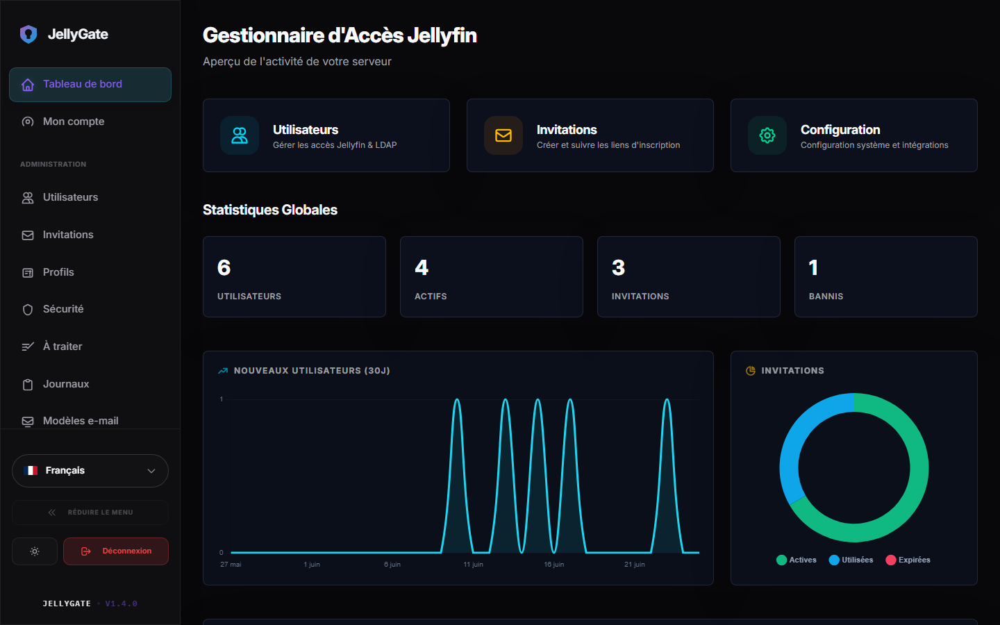
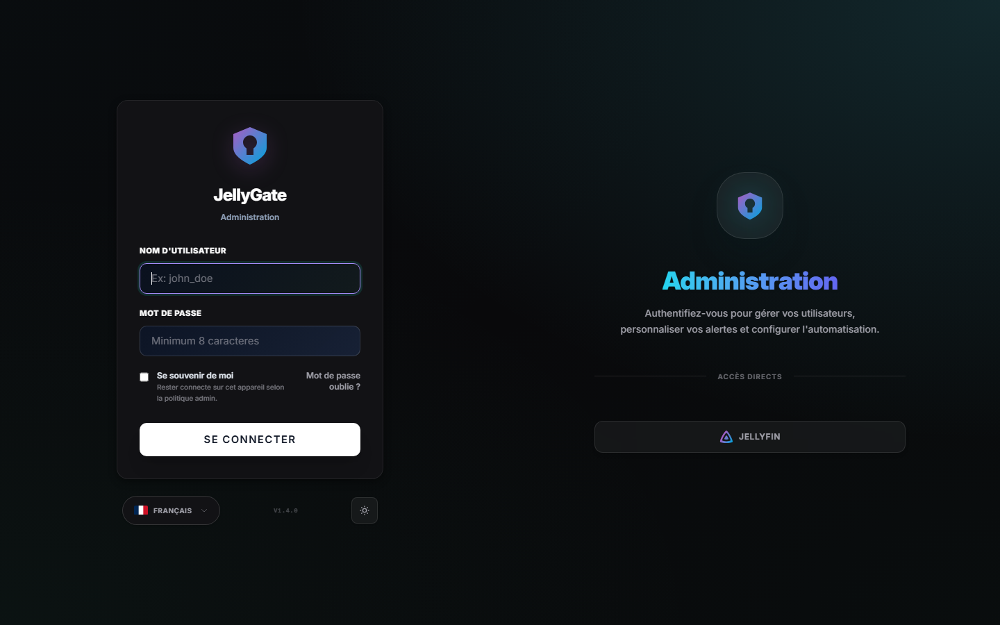
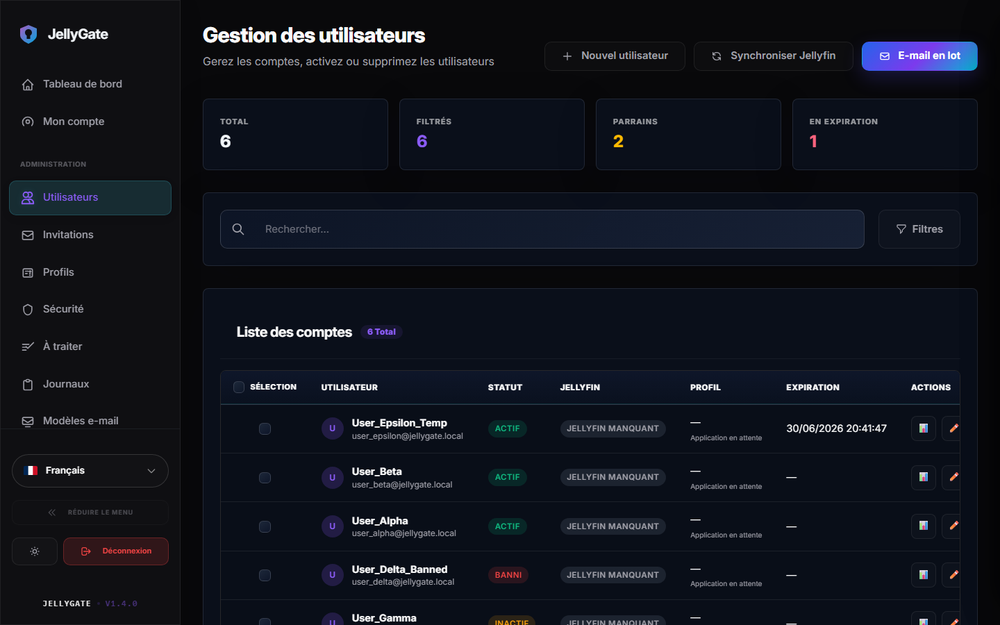
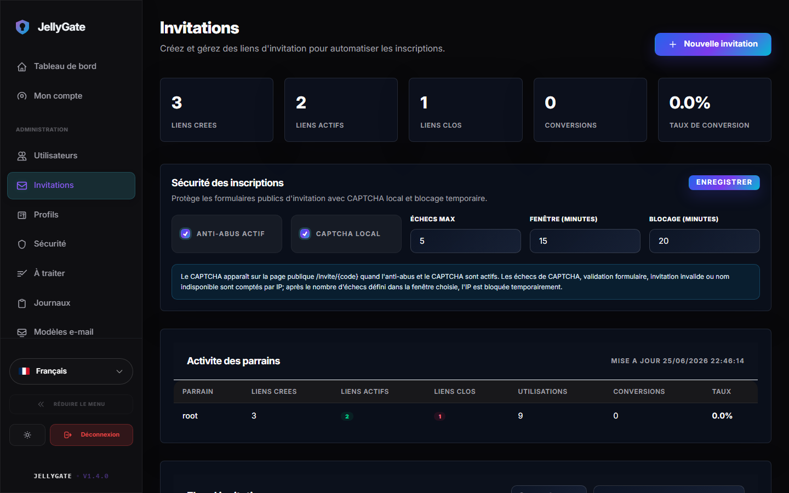
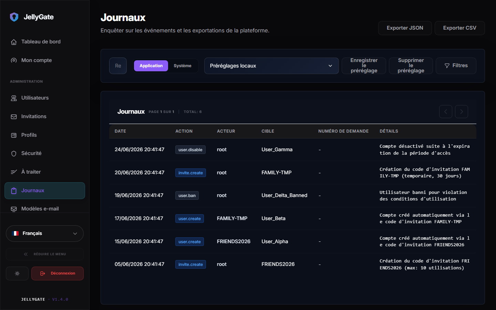
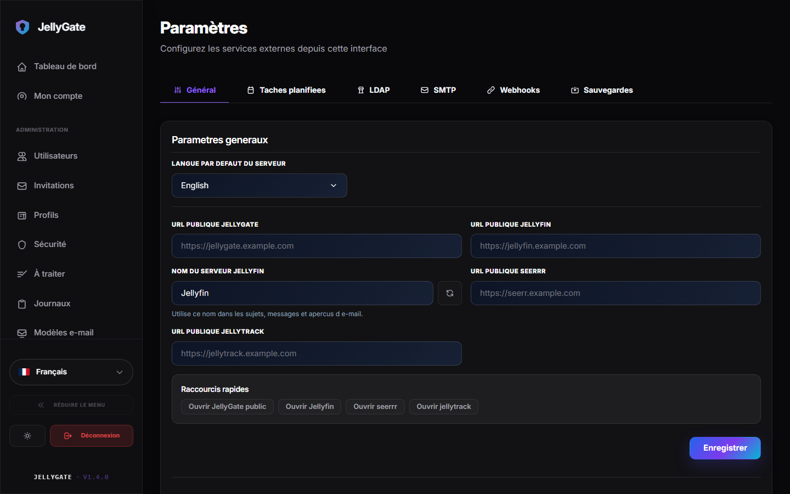

<p align="center">
  
</p>

<h1 align="center">JellyGate</h1>

<p align="center">
  <a href="https://github.com/maelmoreau21/Jellygate/actions/workflows/docker-publish.yml"></a>
  <a href="https://ghcr.io/maelmoreau21/jellygate"></a>
</p>

<p align="center">
  <strong>Admin and onboarding portal for Jellyfin, with native LDAP/Active Directory support.</strong>
</p>

---

## Overview

JellyGate centralizes invitations, account creation, password resets, LDAP / Active Directory integration, and administrative workflows for Jellyfin.

## Screenshots

<p align="center">
  
</p>

<details>
  <summary>📸 More Screenshots / Plus de captures d'écran</summary>
  <br>

  | Login Page | Users Management |
  | :---: | :---: |
  |  |  |

  | Invitations Management | Audit Logs |
  | :---: | :---: |
  |  |  |

  | Settings |
  | :---: |
  |  |
</details>

---

## Installation

Using Docker Compose is the simplest and recommended way to deploy JellyGate. It keeps the stack stable and easy to update.

### 1. Prepare the folder

```bash
mkdir jellygate && cd jellygate
curl -O https://raw.githubusercontent.com/maelmoreau21/JellyGate/main/docker-compose.yml
curl -O https://raw.githubusercontent.com/maelmoreau21/JellyGate/main/.env.example
cp .env.example .env
```

### 2. Configure

Edit `.env` with your settings:

```bash
# Required: secret key for session signing
JELLYGATE_SECRET_KEY=generate_a_random_key_here

# Jellyfin
JELLYFIN_URL=http://your-jellyfin:8096
JELLYFIN_API_KEY=your_admin_api_key
```

### 3. Start

```bash
docker compose up -d
```

> [!IMPORTANT]
> Docker Compose reads the `.env` file from the deployment folder, not `.env.local`.
> After updating `JELLYFIN_API_KEY` or `JELLYFIN_URL`, recreate the container:
> ```bash
> docker compose config
> docker compose up -d --force-recreate
> docker logs jellygate --tail 100
> ```

> [!TIP]
> If you prefer PostgreSQL instead of SQLite, use:
> `docker compose -f docker-compose.postgres.yml up -d`

### 4. Access

Open `http://localhost:8097/admin/login` and sign in with your Jellyfin admin account.

---

## Features

| Area | Details |
|---|---|
| Invitations | Unique links, expiry, quotas, labels, Jellyfin presets, automation mappings |
| Accounts | Atomic provisioning across LDAP + Jellyfin + SQL with rollback on failure |
| Users | Admin listing, toggle access, delete, Jellyfin sync, user profile |
| Password reset | Public request, token flow, Jellyfin + LDAP update |
| Security | CSRF, rate limiting, centralized HTTP headers, signed cookies |
| Audit | Advanced filters, CSV/JSON export, request_id correlation |
| i18n | Full multilingual system (fr, en, etc.) |
| Integrations | SMTP, Discord, Telegram, Matrix, seerrr, JellyTrack |

---

## Configuration

| Variable | Required | Default | Description |
|---|---|---|---|
| `JELLYGATE_SECRET_KEY` | Yes | - | Session signing key (min 32 chars) |
| `JELLYGATE_PORT` | No | `8097` | HTTP port |
| `JELLYGATE_BASE_URL` | No | `http://localhost:8097` | Public base URL |
| `JELLYGATE_DATA_DIR` | No | `/data` | Data directory inside the container |
| `TZ` | No | `UTC` | Timezone (JellyGate uses UTC for logs and timestamps) |
| `JELLYGATE_TRUST_PROXY_HEADERS` | No | `false` | Trust proxy headers (X-Forwarded-For, etc.) for client IP detection |
| `JELLYFIN_URL` | Yes | - | Jellyfin URL |
| `JELLYFIN_API_KEY` | Yes | - | Jellyfin API key |
| `DB_TYPE` | No | Auto-detected | `sqlite` or `postgres`. Auto-detects `postgres` if `DB_HOST` is set |
| `DB_HOST` | If Postgres | - | PostgreSQL server hostname or IP |
| `DB_PORT` | No | `5432` | PostgreSQL server port |
| `DB_NAME` | If Postgres | `jellygate` | PostgreSQL database name |
| `DB_USER` | If Postgres | - | PostgreSQL database username |
| `DB_PASSWORD` | If Postgres | - | PostgreSQL database password |
| `DB_SSLMODE` | No | `disable` | PostgreSQL SSL mode (`disable`, `require`, `verify-full`) |

> [!NOTE]
> If you provide `DB_HOST` in your environment, JellyGate automatically switches to `postgres` mode even if `DB_TYPE` is not explicitly set.
> LDAP, SMTP, webhooks, and email templates are configured directly in the admin UI.

Optional integrations (URLs + API keys):
- `JELLYSEERR_URL` / `JELLYSEERR_API_KEY`
- `JELLYTRACK_URL` / `JELLYTRACK_API_KEY`
- `OMBI_URL` / `OMBI_API_KEY`

---

## Localization

Language selection is automatic in this order: `lang` cookie > `Accept-Language` header > `default_lang`. A language selector is also available in the UI.

---

## Development

```bash
npm run build:css     # Build Tailwind CSS
go build ./...        # Compile check
go test ./...         # Run tests
go run ./cmd/i18ncheck # Verify translations
```

---

## License

This project is licensed under the MIT License - see the [LICENSE](LICENSE) file for details.