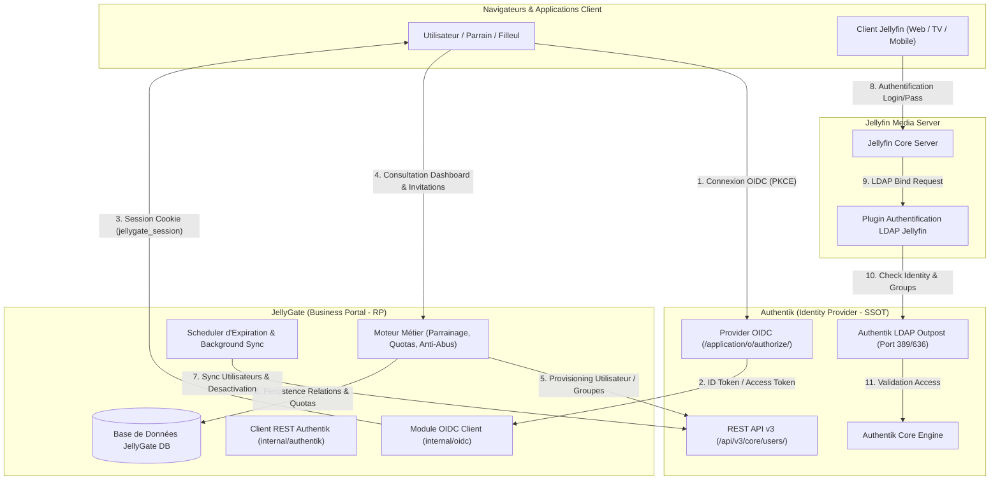
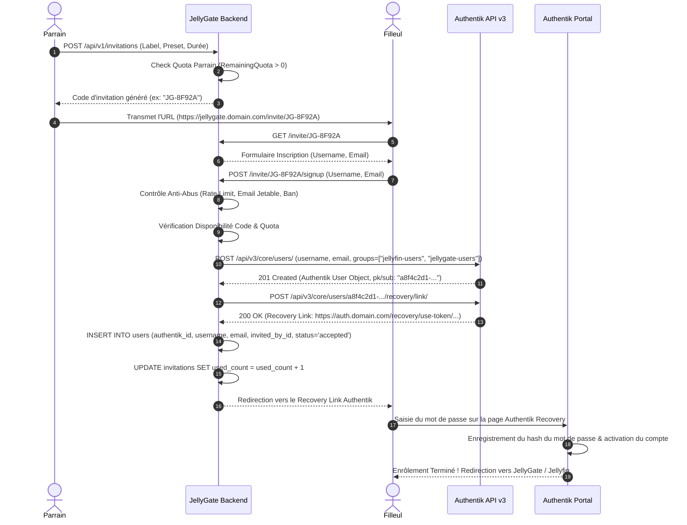
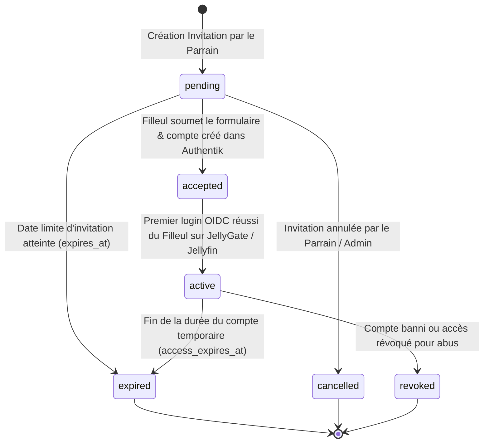

# JellyGate — Conception de l'Architecture Cible Authentik

**Document :** Spécification de l'Architecture Cible & Manuel d'Ingénierie  
**Projet :** JellyGate (`github.com/maelmoreau21/JellyGate`)  
**Version du document :** 2.0 (Post-Audit)  
**Auteur :** Architecte Logiciel Senior (Go, React, OIDC, LDAP, Authentik, Self-Hosted)  
**Date :** Août 2026  

---

## Table des Matières

1. [Vue d'Ensemble & Principes Directeurs](#1-vue-densemble--principes-directeurs)
   * 1.1 [Objectif Cœur](#11-objectif-cœur)
   * 1.2 [Matrice des Responsabilités (SSOT)](#12-matrice-des-responsabilités-ssot)
   * 1.3 [Schéma de l'Architecture Cible](#13-schéma-de-larchitecture-cible)
2. [Gestion de l'Identité & Modèle Utilisateur](#2-gestion-de-lidentité--modèle-utilisateur)
   * 2.1 [Identifiant Primaire & Immuabilité](#21-identifiant-primaire--immuabilité)
   * 2.2 [Claims OIDC Utilisés](#22-claims-oidc-utilisés)
   * 2.3 [Mapping Utilisateur JellyGate ↔ Authentik](#23-mapping-utilisateur-jellygate--authentik)
   * 2.4 [Stratégie de Synchronisation (JIT & Background Sync)](#24-stratégie-de-synchronisation-jit--background-sync)
   * 2.5 [Gestion des Événements du Cycle de Vie](#25-gestion-des-événements-du-cycle-de-vie)
3. [Gestion des Groupes & Autorisations](#3-gestion-des-groupes--autorisations)
   * 3.1 [Convention de Nommage des Groupes Authentik](#31-convention-de-nommage-des-groupes-authentik)
   * 3.2 [Contrôle d'Accès basé sur les Groupes dans JellyGate](#32-contrôle-daccès-basé-sur-les-groupes-dans-jellygate)
4. [Workflow d'Invitation & Enrôlement](#4-workflow-dinvitation--enrôlement)
   * 4.1 [Analyse Comparative des Options d'Enrôlement Authentik](#41-analyse-comparative-des-options-denrôlement-authentik)
   * 4.2 [Workflow Retenu (JellyGate Form + Authentik Provisioning API)](#42-workflow-retenu-jellygate-form--authentik-provisioning-api)
   * 4.3 [Diagramme de Flux d'Invitation Pas à Pas](#43-diagramme-de-flux-dinvitation-pas-à-pas)
5. [Système de Parrainage & Quotas Métier](#5-système-de-parrainage--quotas-métier)
   * 5.1 [Modèle Logique du Parrainage](#51-modèle-logique-du-parrainage)
   * 5.2 [Cycle de Vie des Statuts de Parrainage](#52-cycle-de-vie-des-statuts-de-parrainage)
   * 5.3 [Moteur de Calcul des Quotas](#53-moteur-de-calcul-des-quotas)
   * 5.4 [Règles Anti-Abus et Protection du Système](#54-règles-anti-abus-et-protection-du-système)
6. [Compte Utilisateur & Portail Authentik](#6-compte-utilisateur--portail-authentik)
   * 6.1 [Fonctionnalités Déléguées à Authentik](#61-fonctionnalités-déléguées-à-authentik)
   * 6.2 [Redirections & Liens vers le Portail Authentik](#62-redirections--liens-vers-le-portail-authentik)
7. [Flux OIDC (Authorization Code Grant + PKCE)](#7-flux-oidc-authorization-code-grant--pkce)
   * 7.1 [Séquence d'Authentification OIDC](#71-séquence-dauthentification-oidc)
   * 7.2 [Validation des Jetons JWT & Intégrité](#72-validation-des-jetons-jwt--intégrité)
   * 7.3 [Moteur de Session Interne JellyGate](#73-moteur-de-session-interne-jellygate)
8. [Modèles de Données & Schéma SQL Target](#8-modèles-de-données--schéma-sql-target)
   * 8.1 [Évolution des Tables Existantes](#81-évolution-des-tables-existantes)
   * 8.2 [Nouvelle Structure DDL (SQLite & PostgreSQL)](#82-nouvelle-structure-ddl-sqlite--postgresql)
9. [Spécification des Contrats API Internes](#9-spécification-des-contrats-api-internes)
   * 9.1 [Package Go `internal/oidc`](#91-package-go-internaloidc)
   * 9.2 [Package Go `internal/authentik`](#92-package-go-internalauthentik)
   * 9.3 [Endpoints HTTP Revisités dans JellyGate](#93-endpoints-http-revisités-dans-jellygate)
10. [Gestion des Erreurs & Résilience System](#10-gestion-des-erreurs--résilience-system)
    * 10.1 [Matrice de Gestion des Erreurs Authentik](#101-matrice-de-gestion-des-erreurs-authentik)
    * 10.2 [Pattern Fallback & Circuit Breaker](#102-pattern-fallback--circuit-breaker)
11. [Stratégie de Migration Sans Interruption](#11-stratégie-de-migration-sans-interruption)
    * 11.1 [Plan de Bascule en 6 Phases](#111-plan-de-bascule-en-6-phases)
    * 11.2 [Script de Migration & Rapprochement des Comptes](#112-script-de-migration--rapprochement-des-comptes)
    * 11.3 [Procédure de Rollback en Cas d'Urgence](#113-procédure-de-rollback-en-cas-durgence)

---

## 1. Vue d'Ensemble & Principes Directeurs

### 1.1 Objectif Cœur

JellyGate évolue d'un système d'authentification hybride (créateur direct d'identités LDAP/Jellyfin) vers un **portail métier dédié au parrainage, aux invitations, au suivi des quotas et à la gestion de cycle de vie des accès Jellyfin**, en déléguant **100% de la gestion de l'identité** à **Authentik**.

JellyGate **ne doit plus être un second Identity Provider (IdP)**. Il devient un **Relying Party (RP) OIDC standard** et un consommateur de l'API Authentik.

### 1.2 Matrice des Responsabilités (SSOT)

Pour garantir une séparation stricte des domaines de responsabilité (Separation of Concerns), la répartition des rôles entre Authentik, JellyGate et Jellyfin est définie de la manière suivante :

```
┌────────────────────────────────────────────────────────────────────────┐
│                        AUTHENTIK (Identity SSOT)                        │
├────────────────────────────────────────────────────────────────────────┤
│ • Utilisateurs (Comptes, Profils, UUIDs)                               │
│ • Identifiants (Username, Email, Email Verified)                       │
│ • Secrets (Mots de passe, Moteur de Hash, Sel)                        │
│ • Authentification Multi-Facteurs (TOTP, WebAuthn, Passkeys, FIDO2)    │
│ • Annuaire & Groupes (jellyfin-users, jellygate-admins, etc.)         │
│ • Protocoles SSO (OIDC Provider, Outpost LDAP)                         │
│ • Self-Service Identité (Changement de mot de passe, Reset par mail)   │
└──────────────────────────────────┬─────────────────────────────────────┘
                                   │
         ┌─────────────────────────┴─────────────────────────┐
         │                                                   │
         ▼                                                   ▼
┌────────────────────────────────────────┐  ┌────────────────────────────┐
│      JELLYGATE (Business SSOT)         │  │  JELLYFIN (Media Server)   │
├────────────────────────────────────────┤  ├────────────────────────────┤
│ • Arbre de Parrainage (Parrain/Filleul)│  │ • Serveur Média & Streaming│
│ • Codes d'Invitation & Quotas          │  │ • Authentification via     │
│ • Statuts de Parrainage                │  │   Authentik LDAP Outpost   │
│ • Règles Anti-Abus & Rate Limiting     │  │ • Lecture des médias       │
│ • Ingestion & Traitement des Expirations│  │ • Historique de visionnage │
│ • Dashboard Métier & Analytics         │  │ • JellyGate ne modifie plus│
│ • Notifications Multi-Canaux           │  │   directement Jellyfin !   │
│ • Integration Tierces (Jellyseerr)     │  └────────────────────────────┘
└────────────────────────────────────────┘
```

---

### 1.3 Schéma de l'Architecture Cible



---

## 2. Gestion de l'Identité & Modèle Utilisateur

### 2.1 Identifiant Primaire & Immuabilité

> [!IMPORTANT]  
> **Règle absolue :** L'adresse email ou le nom d'utilisateur ne doivent **jamais** servir de clé primaire d'association inter-systèmes, car ils sont tous deux mutables dans Authentik.

* **Identifiant Primaire Externe (SSOT) :** Le claim `sub` (Subject Identifier) émis par le provider OIDC d'Authentik. Il s'agit d'un **UUID v4 immuable** généré par Authentik lors de la création du compte (ex: `e7f2b9a1-8c3d-4e5f-9a1b-2c3d4e5f6a7b`).
* **Identifiant Primaire Interne JellyGate :** La colonne `id` (INTEGER AUTOINCREMENT sous SQLite / BIGSERIAL sous PostgreSQL) conserve son rôle de clé primaire locale pour garantir des indexation ultra-rapides et préserver les clés étrangères SQL existantes.
* **Liaison d'Identité :** La table `users` de JellyGate possède une contrainte `authentik_id TEXT UNIQUE NOT NULL`.

### 2.2 Claims OIDC Utilisés

Lors de la poignée de main OIDC, JellyGate requiert les scopes OIDC suivants : `openid profile email groups`.

Authentik fournit les claims structurés ci-dessous dans l'ID Token / UserInfo response :

| Claim OIDC | Type | Usage dans JellyGate | Exemple |
| :--- | :--- | :--- | :--- |
| `sub` | `string` (UUID) | Clé d'association unique (`authentik_id`). Immuable. | `"a8f4c2d1-9b3e-4f1a-8c5d-6e7f8a9b0c1d"` |
| `preferred_username` | `string` | Nom d'affichage et login. Synchronisé dans `users.username`. | `"john_doe"` |
| `email` | `string` | Adresse email de contact/notification. Synchronisé dans `users.email`. | `"john.doe@example.com"` |
| `email_verified` | `boolean` | Indicateur de confirmation d'email. | `true` |
| `groups` | `[]string` | Liste des noms de groupes Authentik pour l'attribution des droits. | `["jellygate-users", "jellygate-admins"]` |
| `name` / `nickname` | `string` | Nom complet optionnel pour l'interface UI. | `"John Doe"` |

---

### 2.3 Mapping Utilisateur JellyGate ↔ Authentik

```
Authentik User Entity (API / LDAP)             JellyGate Database (`users` table)
┌────────────────────────────────────┐         ┌─────────────────────────────────────┐
│ pk: "a8f4c2d1-..." (UUID)          │────────►│ authentik_id: "a8f4c2d1-..." (UNIQ)│
│ username: "john_doe"               │────────►│ username: "john_doe"                │
│ email: "john.doe@example.com"      │────────►│ email: "john.doe@example.com"       │
│ is_active: true                    │────────►│ is_active: true                     │
│ groups: ["jellyfin-users"]         │         │ id: 42 (PK locale)                  │
└────────────────────────────────────┘         │ invited_by_id: 12 (FK Parrain)      │
                                               │ custom_quota: 5                     │
                                               │ access_expires_at: 2026-12-31...   │
                                               └─────────────────────────────────────┘
```

---

### 2.4 Stratégie de Synchronisation (JIT & Background Sync)

JellyGate met en œuvre une stratégie de synchronisation **hybride en deux niveaux** pour garantir que ses données locales sont en permanence alignées avec Authentik :

#### 1. Synchronisation Just-In-Time (JIT) lors de la Connexion OIDC
À chaque connexion d'un utilisateur via OIDC :
1. JellyGate extrait le claim `sub` de l'ID Token.
2. Il effectue une recherche `SELECT * FROM users WHERE authentik_id = ?`.
3. **Cas Nouveau Compte (Premier login OIDC post-invitation) :** Si l'enregistrement n'existe pas par `authentik_id`, JellyGate tente une réconciliation par `username` ou `email` (pour les comptes migrés), associe l'UUID `authentik_id` et met à jour les données.
4. **Cas Compte Existant :** JellyGate vérifie si `username` ou `email` ont changé dans Authentik. Si oui, il met à jour la table locale `users` de manière transparente.

#### 2. Synchronisation Périodique en Arrière-Plan (Background Sync Worker)
Toutes les **15 minutes**, la tâche planifiée `sync_authentik_users` s'exécute dans le `scheduler` JellyGate :
1. Appel de l'API Authentik `GET /api/v3/core/users/?ordering=username`.
2. Pour chaque utilisateur retourné par Authentik :
   - Mise à jour de `username`, `email` et de l'état `is_active` dans la base JellyGate.
3. Pour chaque utilisateur dans la base JellyGate ayant un `authentik_id` non présent dans Authentik (ou marqué supprimé) :
   - Exécution de la procédure d'archivage / désactivation locale.

---

### 2.5 Gestion des Événements du Cycle de Vie

#### Scénario A : L'utilisateur modifie son email dans Authentik
1. L'utilisateur se rend sur le portail Authentik (`https://auth.domain.com/if/user/`) et modifie son adresse email.
2. Authentik effectue la vérification du nouvel email (si configurée).
3. Lors du prochain login OIDC ou de la prochaine passe du cron background sync, JellyGate reçoit le nouvel email.
4. JellyGate exécute `UPDATE users SET email = ? WHERE authentik_id = ?`.
5. **Résultat :** L'arbre de parrainage (`invited_by_id`), l'historique et les quotas restent intacts sans moindre interruption.

#### Scénario B : L'utilisateur est supprimé ou désactivé dans Authentik
1. Un administrateur supprime ou désactive le compte dans la console Authentik.
2. Lors de la synchronisation background ou de la réception d'un Webhook Authentik `user_write` / `user_delete` :
3. JellyGate passe `is_active = 0` et enregistre `deleted_at = NOW()` dans sa table `users`.
4. **Conservation de l'intégrité référentielle :** L'enregistrement utilisateur dans JellyGate **n'est pas hard-deleted** afin de ne pas briser la généalogie des filleuls qu'il a parrainés (`invited_by_id`) ni les journaux d'audit.

---

## 3. Gestion des Groupes & Autorisations

### 3.1 Convention de Nommage des Groupes Authentik

Authentik est la source de vérité unique pour les groupes d'utilisateurs. Les groupes suivants doivent être créés dans Authentik :

```
Authentik Group Hierarchy:
├── jellygate-users      # Autorise l'accès au portail métier JellyGate (Rôle Utilisateur)
├── jellygate-admins     # Octroie les privilèges d'administration dans JellyGate (Rôle Admin)
├── jellyfin-users       # Autorise la connexion au serveur média Jellyfin via l'Outpost LDAP
└── jellyfin-admins      # Octroie les droits d'administration dans Jellyfin
```

---

### 3.2 Contrôle d'Accès basé sur les Groupes dans JellyGate

Lors du callback OIDC, JellyGate inspecte le claim `groups` contenu dans le jeton ID JWT :

```go
func DetermineUserRole(groups []string) (isAdmin bool, hasAccess bool) {
    for _, g := range groups {
        if g == "jellygate-admins" {
            isAdmin = true
            hasAccess = true
            return
        }
        if g == "jellygate-users" {
            hasAccess = true
        }
    }
    return isAdmin, hasAccess
}
```

* **Déni d'accès :** Si l'utilisateur ne possède ni `jellygate-users` ni `jellygate-admins`, JellyGate refuse d'établir une session et redirige vers une page d'erreur 403 i18n ("Accès non autorisé au portail JellyGate").
* **Élévation de privilèges :** Le statut d'administrateur dans JellyGate (`IsAdmin = true` dans le cookie de session) est exclusivement piloté par la présence du groupe `jellygate-admins` dans Authentik. JellyGate ne stocke plus de flag admin statique modifiable localement sans passer par Authentik.

---

## 4. Workflow d'Invitation & Enrôlement

### 4.1 Analyse Comparative des Options d'Enrôlement Authentik

Afin d'intégrer de manière optimale la création de compte Authentik dans le processus de parrainage JellyGate, trois alternatives techniques ont été évaluées :

| Critère | Option A : Stage Invitation Authentik (Flow Natif Authentik) | Option B : API Provisioning Authentik + Link Recovery (Retenu) | Option C : API Provisioning Direct avec Mot de Passe Formulaire |
| :--- | :--- | :--- | :--- |
| **Description** | JellyGate génère un token d'invitation Authentik via API, puis redirige le filleul vers la page d'enrôlement Authentik. | Le filleul remplit le formulaire sur JellyGate. JellyGate crée le compte dans Authentik via API REST Admin et génère un lien d'initialisation de mot de passe. | Le filleul saisit son username, email ET mot de passe sur le formulaire JellyGate. JellyGate crée le compte complet dans Authentik via API. |
| **Expérience Utilisateur (UX)** | Deux étapes avec changement de domaine/UI (JellyGate -> Authentik). | Interface 100% JellyGate pour la saisie de l'invitation + Redirection directe vers la création de mot de passe Authentik. | Fluidité maximale perçue sur JellyGate, mais JellyGate manipule le mot de passe en clair du filleul pendant la requête. |
| **Sécurité Zero-Trust** | Maximale (JellyGate ne voit jamais le mot de passe). | **Maximale** (JellyGate ne manipule aucun mot de passe ; la création du secret a lieu sur Authentik). | Faible (Violation du principe où JellyGate ne doit plus manipuler de crédentiels). |
| **Contrôle Métier & Quotas** | Complexe (Nécessite des Webhooks Authentik de callback pour lier le filleul au parrain). | **Parfait** (Liaison parrain/filleul atomique dans JellyGate au moment de la soumission). | Parfait. |
| **Statut Recommandé** | Alternative possible. | **RECOMMANDÉ & RETENU** | À rejeter (Non conforme aux exigences de l'audit). |

---

### 4.2 Workflow Retenu (JellyGate Form + Authentik Provisioning API)

L'**Option B** est retenue car elle concilie une étanchéité totale de la sécurité des mots de passe (qui ne transitent jamais par JellyGate) avec la maîtrise absolue de la logique métier par JellyGate (arbre de parrainage, anti-abus, validation de quota).

---

### 4.3 Diagramme de Flux d'Invitation Pas à Pas



---

## 5. Système de Parrainage & Quotas Métier

### 5.1 Modèle Logique du Parrainage

Le parrainage repose sur la relation dirigée parent-enfant entre deux utilisateurs enregistrés dans JellyGate.

```
┌────────────────────────────────────────────────────────────────────────┐
│                          USER: Parrain (ID: 10)                        │
│                     authentik_id: "c1a2b3-..."                         │
│                     custom_quota: 5, bonus_quota: 1                    │
└──────────────────────────────────┬─────────────────────────────────────┘
                                   │
                                   │ Génère l'invitation "JG-ALPHA"
                                   ▼
┌────────────────────────────────────────────────────────────────────────┐
│                        INVITATION: code "JG-ALPHA"                     │
│                        created_by_user_id: 10                          │
│                        status: "accepted"                              │
└──────────────────────────────────┬─────────────────────────────────────┘
                                   │
                                   │ Consommée par le Filleul
                                   ▼
┌────────────────────────────────────────────────────────────────────────┐
│                          USER: Filleul (ID: 25)                        │
│                     authentik_id: "d4e5f6-..."                         │
│                     invited_by_id: 10                                  │
│                     referral_status: "active"                          │
└────────────────────────────────────────────────────────────────────────┘
```

---

### 5.2 Cycle de Vie des Statuts de Parrainage

Chaque relation de parrainage passe par des statuts formels et strictement définis :



#### Définition des Statuts :
1. `pending` : L'invitation est générée par le parrain et active sur JellyGate. En attente de consommation.
2. `accepted` : Le filleul a rempli le formulaire d'inscription. Le compte Authentik est provisionné et le lien de réinitialisation généré.
3. `active` : Le filleul a validé son mot de passe et s'est authentifié au moins une fois via OIDC ou LDAP.
4. `expired` : L'invitation n'a pas été utilisée avant sa date d'expiration, OU le compte temporaire du filleul a atteint sa date de fin d'accès (`access_expires_at`).
5. `cancelled` : Le parrain ou l'administrateur a supprimé le code d'invitation avant sa consommation.
6. `revoked` : Le filleul ou le parrain a été banni suite à un abus. Les accès Authentik sont révoqués par JellyGate.

---

### 5.3 Moteur de Calcul des Quotas

Le quota d'invitation d'un parrain détermine sa capacité à générer de nouvelles invitations.

#### Formule de Calcul du Quota Maximal :
$$\text{QuotaTotal} = \text{DefaultGlobalQuota} + \text{CustomUserQuota} + \text{BonusQuota} - \text{MalusQuota}$$

Où :
* `DefaultGlobalQuota` : Valeur par défaut dans les paramètres système (`settings.default_invite_quota`, ex: `3`).
* `CustomUserQuota` : Surcharge individuelle définie par un administrateur (`users.custom_quota`).
* `BonusQuota` : Invitations bonus attribuées (ex: récompense de parrainage modèle).
* `MalusQuota` : Pénalité appliquée (ex: filleul banni pour non-respect des règles).

#### Formule du Quota Consommé :
$$\text{QuotaUtilisé} = \text{Nombre d'invitations actives en statut } (\text{'pending'} \lor \text{'accepted'} \lor \text{'active'})$$

#### Formule du Quota Restant :
$$\text{QuotaRestant} = \max(0, \text{QuotaTotal} - \text{QuotaUtilisé})$$

Si $\text{QuotaRestant} \le 0$, l'API JellyGate rejette toute création d'invitation avec un code HTTP `403 Forbidden` et le message d'erreur i18n `error.quota_exceeded`.

---

### 5.4 Règles Anti-Abus et Protection du Système

JellyGate intègre un sous-système de contrôle anti-abus s'exécutant **avant** tout appel à l'API Authentik :

1. **Rate Limiting sur la Création et la Soumission :** Maximum 5 invitations générées par parrain par heure. Maximum 3 tentatives de soumission par adresse IP par tranche de 15 minutes.
2. **Filtrage des Adresses Email Jetables (Disposable Email Check) :** Validation du domaine email contre une liste noire intégrée (`internal/handlers/invite_abuse.go`) et vérification de la présence d'enregistrements DNS MX valides.
3. **Détection d'Auto-Parrainage et de Parrainage Circulaire :** Rejet des soumissions où l'adresse IP ou l'empreinte navigateur du filleul correspond exactement à celle du parrain lors de la génération de l'invitation.
4. **Bannissement en Cascade (Cascade Revocation) :** Si un compte parrain est marqué `is_banned = 1` par un administrateur, une option permet de suspendre automatiquement l'ensemble des comptes filleuls associés (`status = 'revoked'`) et de désactiver leurs comptes dans Authentik via l'API.

---

## 6. Compte Utilisateur & Portail Authentik

### 6.1 Fonctionnalités Déléguées à Authentik

JellyGate supprime définitivement tous les formulaires, contrôleurs, templates HTML et tables de données relatifs aux fonctions d'identité pures :

* **Mots de passe :** Plus de formulaire de modification de mot de passe dans JellyGate.
* **Réinitialisation de mot de passe :** Suppression du package de reset par token (`/password-reset`).
* **Double Authentification (MFA / 2FA) :** Entièrement gérée sur Authentik (support TOTP, YubiKey, Passkeys, Push notifications).
* **Vérification d'Email :** Prise en charge intégrale par les Flows d'Inscription/Enrollment d'Authentik.

---

### 6.2 Redirections & Liens vers le Portail Authentik

Dans l'interface utilisateur de JellyGate (Mon Compte / `/account`), la section "Sécurité & Identifiants" affiche des boutons de redirection externe pointant directement vers le portail Authentik :

```html
<!-- Extrait des nouveaux boutons du Dashboard Utilisateur JellyGate -->
<div class="account-security-card">
  <h3>{{ i18n "account.security.title" }}</h3>
  <p>{{ i18n "account.security.description" }}</p>
  
  <div class="button-group">
    <!-- Lien vers l'interface de gestion du profil Authentik -->
    <a href="{{ .AuthentikBaseURL }}/if/user/#/settings" 
       target="_blank" rel="noopener noreferrer" class="btn btn-secondary">
       <i class="icon-user"></i> {{ i18n "account.security.edit_profile" }}
    </a>

    <!-- Lien direct vers le Flow de changement de mot de passe -->
    <a href="{{ .AuthentikBaseURL }}/if/flow/initial-password-change/" 
       target="_blank" rel="noopener noreferrer" class="btn btn-secondary">
       <i class="icon-key"></i> {{ i18n "account.security.change_password" }}
    </a>

    <!-- Lien direct vers la gestion du MFA -->
    <a href="{{ .AuthentikBaseURL }}/if/user/#/settings;section=mfa" 
       target="_blank" rel="noopener noreferrer" class="btn btn-secondary">
       <i class="icon-shield"></i> {{ i18n "account.security.manage_mfa" }}
    </a>
  </div>
</div>
```

---

## 7. Flux OIDC (Authorization Code Grant + PKCE)

### 7.1 Séquence d'Authentification OIDC

JellyGate implémente le flux **OAuth 2.0 Authorization Code Grant avec extension PKCE (RFC 7636)** pour prémunir le portail contre les attaques par interception de code et CSRF.

```mermaid
sequenceDiagram
    autonumber
    actor User as Utilisateur
    participant Browser as Navigateur Web
    participant JG as JellyGate Client OIDC
    participant Auth as Authentik OIDC Provider

    User->>Browser: Clique sur "Se Connecter avec Authentik"
    Browser->>JG: GET /auth/login
    
    JG->>JG: Génère State (Cryptographique) & Code Verifier PKCE
    JG->>JG: Calcule Code Challenge = Base64URL(SHA256(Code Verifier))
    JG->>Browser: Poser Cookie Temp Cookie "jellygate_oidc_state" (HttpOnly, Secure, Exp: 10m)
    JG-->>Browser: Redirection 302 vers Authentik Authorization Endpoint<br/>(/application/o/authorize/?client_id=...&response_type=code&scope=openid+profile+email+groups&code_challenge=...&code_challenge_method=S256&state=...)

    Browser->>Auth: GET /application/o/authorize/
    Auth->>User: Formulaire de Login Authentik & Check MFA
    User->>Auth: Saisie Mots de passe / Valide MFA
    Auth-->>Browser: Redirection 302 vers Callback JellyGate<br/>(/auth/callback?code=AUTH_CODE_XYZ&state=...)

    Browser->>JG: GET /auth/callback?code=AUTH_CODE_XYZ&state=...
    JG->>JG: Vérifie le paramètre State vs Cookie "jellygate_oidc_state"
    
    JG->>Auth: POST /application/o/token/<br/>(grant_type=authorization_code, code=AUTH_CODE_XYZ, code_verifier=..., client_id=...)
    Auth-->>JG: 200 OK (id_token JWT, access_token, refresh_token)

    JG->>JG: Valide la signature JWT de id_token via JWKS Authentik
    JG->>JG: Extrait Claims (sub, preferred_username, email, groups)
    JG->>JG: Exécute JIT Sync User dans DB JellyGate
    JG->>JG: Génère Session Interne HMAC "jellygate_session"
    JG-->>Browser: Set-Cookie: jellygate_session=...; Redirection vers /admin (Dashboard)
```

---

### 7.2 Validation des Jetons JWT & Intégrité

Le package `internal/oidc` procède à la vérification systématique de l'ID Token JWT reçu :

1. **Récupération des Clés Publiques (JWKS) :** Téléchargement et mise en cache mémoire (avec rafraîchissement toutes les 24h) des clés publiques RSA/ECDSA depuis l'endpoint Authentik `https://auth.domain.com/application/o/jellygate/jwks/`.
2. **Vérification de la Signature :** Validation cryptographique de l'en-tête du token via l'algorithme `RS256` ou `ES256`.
3. **Vérification des Assertions Standard :**
   * `iss` (Issuer) doit correspondre exactement à l'URL configurée dans JellyGate (`authentik_issuer_url`).
   * `aud` (Audience) doit contenir le `client_id` de JellyGate.
   * `exp` (Expiration) doit être supérieur au timestamp Unix courant UTC.

---

### 7.3 Moteur de Session Interne JellyGate

Une fois l'identité OIDC validée, JellyGate bascule sur son propre moteur de session par cookie signé HMAC-SHA256 (évitant de requêter Authentik à chaque appel de page HTTP) :

```go
type SessionPayload struct {
    UserID      int64    `json:"uid"` // Primary Key locale JellyGate
    AuthentikID string   `json:"sid"` // Claim 'sub' Authentik (UUID)
    Username    string   `json:"usr"` // Nom d'utilisateur synchronisé
    Email       string   `json:"eml"` // Email synchronisé
    IsAdmin     bool     `json:"adm"` // Statut Admin piloté par le groupe jellygate-admins
    Exp         int64    `json:"exp"` // Timestamp d'expiration de session (ex: 24h)
    Iat         int64    `json:"iat"` // Timestamp de création
}
```

---

## 8. Modèles de Données & Schéma SQL Target

### 8.1 Évolution des Tables Existantes

| Table | Statut Architectural | Adaptations Cibles |
| :--- | :---: | :--- |
| `users` | **MAINTENUE & REFACTORISÉE** | Ajout de `authentik_id TEXT UNIQUE NOT NULL`. La colonne `ldap_dn` est supprimée/obsolète. Remplacement de `invited_by` (TEXT) par `invited_by_id` (FK INTEGER vers `users.id`). Ajout des colonnes de surcharge de quota (`custom_quota`, `bonus_quota`, `malus_quota`). |
| `invitations` | **MAINTENUE** | 100% conservée. Mise à jour de la relation `created_by` pour lier avec `users.id`. Ajout du champ `authentik_group_id` pour mapper le profil au groupe Authentik à attribuer au filleul. |
| `referrals` | **NOUVELLE TABLE (Optionnelle)** | Table explicite de suivi de parrainage isolant la relation parrain/filleul, les dates et l'historique des statuts (`pending`, `accepted`, `active`, `expired`, `revoked`). |
| `settings` | **MAINTENUE** | Suppression des clés `ldap_*`. Ajout des clés `authentik_url`, `authentik_api_token`, `oidc_client_id`, `oidc_client_secret`, `oidc_issuer_url`. |
| `audit_log` | **MAINTENUE** | Conservée à 100% pour le journal d'audit métier. |
| `security_events` | **MAINTENUE** | Conservée à 100% pour l'enregistrement des blocages anti-abus. |
| `password_resets` | **DEPRECATED / REMOVED** | Table supprimée (gérée par Authentik). |
| `email_verifications` | **DEPRECATED / REMOVED** | Table supprimée (gérée par Authentik). |

---

### 8.2 Nouvelle Structure DDL (SQLite & PostgreSQL)

Voici le schéma DDL complet et rétro-compatible supportant dynamiquement SQLite 3 et PostgreSQL 12+ :

```sql
-- ============================================================================
-- 1. TABLE USERS (Répertoire Métier & Liens Identity Authentik)
-- ============================================================================
CREATE TABLE IF NOT EXISTS users (
    id                      INTEGER PRIMARY KEY AUTOINCREMENT, -- (BIGSERIAL sous PostgreSQL)
    authentik_id            TEXT UNIQUE NOT NULL,              -- UUID OIDC 'sub' Authentik
    username                TEXT UNIQUE NOT NULL,              -- Claim 'preferred_username'
    email                   TEXT NOT NULL DEFAULT '',          -- Claim 'email'
    invited_by_id           INTEGER REFERENCES users(id) ON DELETE SET NULL, -- Parrain ID
    is_active               BOOLEAN NOT NULL DEFAULT 1,
    is_banned               BOOLEAN NOT NULL DEFAULT 0,
    
    -- Moteur de Quota Perso & Surcharges
    custom_quota            INTEGER DEFAULT NULL,              -- NULL = Utilise default_quota
    bonus_quota             INTEGER NOT NULL DEFAULT 0,
    malus_quota             INTEGER NOT NULL DEFAULT 0,
    
    -- Paramètres Métier & Notifications
    preferred_lang          TEXT NOT NULL DEFAULT 'fr',
    contact_discord         TEXT NOT NULL DEFAULT '',
    contact_telegram        TEXT NOT NULL DEFAULT '',
    contact_matrix          TEXT NOT NULL DEFAULT '',
    opt_in_email            BOOLEAN NOT NULL DEFAULT 1,
    
    -- Gestion d'Expiration des Accès Temporaires
    access_expires_at       DATETIME DEFAULT NULL,
    expired_at              DATETIME DEFAULT NULL,
    expiry_action           TEXT NOT NULL DEFAULT 'disable',   -- 'disable' ou 'delete'
    
    -- Audit Timestamps
    created_at              DATETIME NOT NULL DEFAULT CURRENT_TIMESTAMP,
    updated_at              DATETIME NOT NULL DEFAULT CURRENT_TIMESTAMP
);

CREATE INDEX IF NOT EXISTS idx_users_authentik_id ON users(authentik_id);
CREATE INDEX IF NOT EXISTS idx_users_username ON users(username);
CREATE INDEX IF NOT EXISTS idx_users_invited_by ON users(invited_by_id);

-- ============================================================================
-- 2. TABLE INVITATIONS (Codes d'Invitation Métier)
-- ============================================================================
CREATE TABLE IF NOT EXISTS invitations (
    id                      INTEGER PRIMARY KEY AUTOINCREMENT,
    code                    TEXT UNIQUE NOT NULL,
    label                   TEXT NOT NULL DEFAULT '',
    created_by_user_id      INTEGER NOT NULL REFERENCES users(id) ON DELETE CASCADE,
    authentik_group_id      TEXT NOT NULL DEFAULT 'jellyfin-users', -- Groupe Authentik à affecter
    max_uses                INTEGER NOT NULL DEFAULT 1,
    used_count              INTEGER NOT NULL DEFAULT 0,
    is_temporary            BOOLEAN NOT NULL DEFAULT 0,
    account_duration_days   INTEGER NOT NULL DEFAULT 0,
    expires_at              DATETIME DEFAULT NULL,
    created_at              DATETIME NOT NULL DEFAULT CURRENT_TIMESTAMP
);

CREATE INDEX IF NOT EXISTS idx_invitations_code ON invitations(code);
CREATE INDEX IF NOT EXISTS idx_invitations_creator ON invitations(created_by_user_id);

-- ============================================================================
-- 3. TABLE REFERRALS (Historique & Suivi Formel du Parrainage)
-- ============================================================================
CREATE TABLE IF NOT EXISTS referrals (
    id                      INTEGER PRIMARY KEY AUTOINCREMENT,
    sponsor_user_id         INTEGER NOT NULL REFERENCES users(id) ON DELETE CASCADE,
    godchild_user_id        INTEGER REFERENCES users(id) ON DELETE SET NULL,
    invitation_id           INTEGER REFERENCES invitations(id) ON DELETE SET NULL,
    status                  TEXT NOT NULL DEFAULT 'pending', -- pending, accepted, active, expired, cancelled, revoked
    accepted_at             DATETIME DEFAULT NULL,
    activated_at            DATETIME DEFAULT NULL,
    created_at              DATETIME NOT NULL DEFAULT CURRENT_TIMESTAMP,
    updated_at              DATETIME NOT NULL DEFAULT CURRENT_TIMESTAMP
);

CREATE INDEX IF NOT EXISTS idx_referrals_sponsor ON referrals(sponsor_user_id);
CREATE INDEX IF NOT EXISTS idx_referrals_godchild ON referrals(godchild_user_id);
CREATE INDEX IF NOT EXISTS idx_referrals_status ON referrals(status);
```

---

## 9. Spécification des Contrats API Internes

### 9.1 Package Go `internal/oidc`

Ce package remplace le système de login local par le client OIDC standard.

```go
package oidc

import (
	"context"
	"net/http"
)

type Claims struct {
	Sub               string   `json:"sub"`
	PreferredUsername string   `json:"preferred_username"`
	Email             string   `json:"email"`
	EmailVerified     bool     `json:"email_verified"`
	Groups            []string `json:"groups"`
}

type Client interface {
	// GenerateAuthURL construit l'URL de redirection Authentik avec State et Code Challenge PKCE.
	GenerateAuthURL(w http.ResponseWriter, r *http.Request) (authURL string, err error)

	// HandleCallback valide le state, procède à l'échange de token via PKCE et extrait les Claims.
	HandleCallback(r *http.Request) (*Claims, error)

	// ValidateIDToken vérifie la signature JWKS, la date d'expiration et l'issuer du jeton JWT.
	ValidateIDToken(ctx context.Context, rawIDToken string) (*Claims, error)
}
```

---

### 9.2 Package Go `internal/authentik`

Ce package encapsulate l'ensemble des interactions REST avec la v3 d'API Authentik (`/api/v3/`).

```go
package authentik

import "context"

type UserCreatePayload struct {
	Username string   `json:"username"`
	Name     string   `json:"name"`
	Email    string   `json:"email"`
	IsActive bool     `json:"is_active"`
	Groups   []string `json:"groups"` // IDs ou noms des groupes Authentik
}

type UserResponse struct {
	PK       int64  `json:"pk"`
	ID       string `json:"uid"` // UUID String
	Username string `json:"username"`
	Email    string `json:"email"`
	IsActive bool   `json:"is_active"`
}

type Client interface {
	// CreateUser provisionne un nouvel utilisateur dans Authentik.
	CreateUser(ctx context.Context, payload UserCreatePayload) (*UserResponse, error)

	// CreateRecoveryLink génère un lien d'initialisation de mot de passe à transmettre au filleul.
	CreateRecoveryLink(ctx context.Context, authentikPK int64) (recoveryLink string, err error)

	// AddUserToGroup ajoute l'utilisateur au groupe Authentik spécifié (ex: jellyfin-users).
	AddUserToGroup(ctx context.Context, userPK int64, groupID string) error

	// SetUserActiveStatus active ou désactive un compte utilisateur dans Authentik.
	SetUserActiveStatus(ctx context.Context, userPK int64, active bool) error

	// DeleteUser supprime définitivement un utilisateur dans Authentik.
	DeleteUser(ctx context.Context, userPK int64) error

	// ListUsers récupère la liste complète des utilisateurs pour la tâche de sync background.
	ListUsers(ctx context.Context) ([]UserResponse, error)
}
```

---

### 9.3 Endpoints HTTP Revisités dans JellyGate

```
[AUTH ENDPOINTS]
GET  /auth/login             -> Initié par l'utilisateur, déclenche l'URL OIDC Authentik + PKCE
GET  /auth/callback          -> Callback OIDC Authentik, vérification PKCE, JIT Sync & Session Cookie
POST /auth/logout            -> Invalide la session JellyGate & redirige vers Authentik OIDC EndSession

[INVITATION ENDPOINTS (PUBLIC)]
GET  /invite/{code}          -> Affiche la landing page d'invitation (Vérifie la validité du code)
POST /invite/{code}/signup   -> Soumission du filleul (Username/Email). Déclenche API Authentik & Redirection

[USER DASHBOARD ENDPOINTS (PROTECTED)]
GET  /account                -> Tableau de bord utilisateur (Statistiques de parrainage, Filleuls, Quota)
GET  /account/invitations    -> Liste des codes d'invitations générés par l'utilisateur
POST /account/invitations    -> Génère un nouveau code (Validation du quota restant)

[ADMIN ENDPOINTS (PROTECTED - REQUIRE GROUP 'jellygate-admins')]
GET  /admin/users            -> Vue d'ensemble des utilisateurs enregistrés & état de sync Authentik
POST /admin/users/{id}/quota -> Surcharge le quota d'un parrain (custom_quota, bonus, malus)
POST /admin/users/{id}/ban   -> Banni un utilisateur & désactive son compte dans Authentik via REST API
```

---

## 10. Gestion des Erreurs & Résilience System

### 10.1 Matrice de Gestion des Erreurs Authentik

| Composant Invoqué | Scénario d'Erreur | Impact Système | Stratégie de Résolution & Fallback |
| :--- | :--- | :--- | :--- |
| **Authentik OIDC Service** | Service Authentik indisponible ou Timeout HTTP lors de `/auth/login`. | Impossible de se connecter à JellyGate via SSO. | Afficher une page d'erreur i18n élégante (`503 Service Unavailable`) invitant l'utilisateur à réessayer dans quelques instants. Les sessions déjà ouvertes continuent de fonctionner via le cookie signé HMAC local ! |
| **Authentik REST API** | Échec de création d'utilisateur lors de la soumission de l'invitation (`POST /api/v3/core/users/`). | Le filleul ne peut pas être provisionné immédiatement dans Authentik. | **Transaction Rollback :** JellyGate ne consomme pas l'invitation, annule l'enregistrement DB local et informe l'utilisateur avec un message clair (ex: "Nom d'utilisateur ou email déjà utilisé dans le système central"). |
| **Authentik Recovery API** | Échec de génération du lien de recovery (`CreateRecoveryLink`). | Le compte Authentik est créé mais le filleul n'a pas son lien initial. | JellyGate retente l'appel 3 fois avec exponential backoff. En cas d'échec persistant, le compte est créé et une notification mail fallback est déclenchée via le service SMTP de JellyGate. |
| **Authentik Outpost LDAP** | Interruption du service Outpost LDAP. | Jellyfin ne peut plus valider les connexions des utilisateurs streaming. | L'Outpost LDAP doit être déployé en haute disponibilité (2 répliques conteneurisées) avec auto-restart Docker/Kubernetes. |

---

### 10.2 Pattern Fallback & Circuit Breaker

Les appels sortants vers l'API Authentik dans `internal/authentik` sont encapsulés avec un timeout strict (5 secondes par défaut) et un interrupteur de circuit (Circuit Breaker) pour éviter de bloquer les goroutines du serveur web JellyGate en cas d'indisponibilité d'Authentik.

---

## 11. Stratégie de Migration Sans Interruption

### 11.1 Plan de Bascule en 6 Phases

```
┌────────────────────────────────────────────────────────────────────────┐
│ Phase 1 : Infrastructure & Deployment Authentik                        │
│ • Déploiement du stack Authentik Server + Outpost LDAP                 │
│ • Configuration du Flow OIDC Application "JellyGate" dans Authentik    │
└──────────────────────────────────┬─────────────────────────────────────┘
                                   │
                                   ▼
┌────────────────────────────────────────────────────────────────────────┐
│ Phase 2 : Importation & Synchronisation des Identités Existantes       │
│ • Script d'exportation des comptes DB JellyGate/LDAP vers Authentik    │
│ • Génération des UUIDs Authentik & Association dans `users.authentik_id`│
└──────────────────────────────────┬─────────────────────────────────────┘
                                   │
                                   ▼
┌────────────────────────────────────────────────────────────────────────┐
│ Phase 3 : Bascule de l'Authentification Jellyfin                       │
│ • Reconfiguration du Plugin LDAP Jellyfin pour pointer vers Outpost    │
│ • Validation des accès streaming de tous les utilisateurs              │
└──────────────────────────────────┬─────────────────────────────────────┘
                                   │
                                   ▼
┌────────────────────────────────────────────────────────────────────────┐
│ Phase 4 : Implémentation du Client OIDC dans JellyGate                 │
│ • Livraisons du package `internal/oidc` & Middleware OAuth2/PKCE       │
│ • Bascule de l'authentification Admin/User JellyGate vers OIDC SSO     │
└──────────────────────────────────┬─────────────────────────────────────┘
                                   │
                                   ▼
┌────────────────────────────────────────────────────────────────────────┐
│ Phase 5 : Provisioning via API REST Authentik                          │
│ • Remplacement du package `internal/ldap` par `internal/authentik`     │
│ • Migration des flux d'invitation et du scheduler d'expiration         │
└──────────────────────────────────┬─────────────────────────────────────┘
                                   │
                                   ▼
┌────────────────────────────────────────────────────────────────────────┐
│ Phase 6 : Nettoyage et Dépréciation du Code Obsolète                  │
│ • Suppression des tables `password_resets` & `email_verifications`     │
│ • Suppression intégrale du package Go `internal/ldap`                  │
└────────────────────────────────────────────────────────────────────────┘
```

---

### 11.2 Script de Migration & Rapprochement des Comptes

Lors de la Phase 2, un script de migration Go dédié (`cmd/tools/migrate_to_authentik.go`) s'exécute pour réaliser la transition des données existantes sans perte :

```go
// Extrait de l'algorithme de migration des comptes existants
func MigrateExistingUsers(ctx context.Context, db *database.DB, authClient authentik.Client) error {
    users, err := db.GetAllUsers(ctx)
    if err != nil {
        return err
    }

    for _, u := range users {
        if u.AuthentikID != "" {
            continue // Déjà migré
        }

        // 1. Créer l'utilisateur dans Authentik via API REST
        authResp, err := authClient.CreateUser(ctx, authentik.UserCreatePayload{
            Username: u.Username,
            Email:    u.Email,
            IsActive: u.IsActive,
            Groups:   []string{"jellyfin-users", "jellygate-users"},
        })
        if err != nil {
            log.Printf("Erreur migration utilisateur %s: %v", u.Username, err)
            continue
        }

        // 2. Mettre à jour l'enregistrement JellyGate avec l'UUID Authentik
        err = db.Exec(ctx, "UPDATE users SET authentik_id = ? WHERE id = ?", authResp.ID, u.ID)
        if err != nil {
            return err
        }
        
        // 3. Déclencher un envoi de mail de réinitialisation de mot de passe Authentik
        _, _ = authClient.CreateRecoveryLink(ctx, authResp.PK)
    }
    return nil
}
```

---

### 11.3 Procédure de Rollback en Cas d'Urgence

1. **Sauvegarde Préalable :** Un snapshot complet de la base de données JellyGate (`jellygate.db` ou PostgreSQL dump) est réalisé avant le déploiement de la Phase 4.
2. **Mécanisme d'Urgence :** Étant donné que JellyGate conserve l'intégralité des données métier (invitations, parrainages, historiques), en cas de défaillance majeure du cluster Authentik, la base JellyGate reste parfaitement saine.
3. **Procédure de Rollback :** Redéploiement de l'image binaire JellyGate précédente et restauration de la configuration LDAP d'origine. Aucune donnée de parrainage ne sera perdue.

---

> [!NOTE]  
> **Conclusion Architectural :**  
> Ce document définit l'architecture cible exacte de JellyGate avec Authentik. Il garantit la transformation de JellyGate en un portail métier moderne, hautement sécurisé et parfaitement découplé du stockage des identités.
