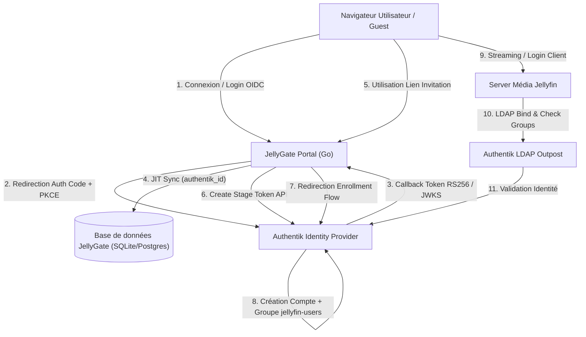
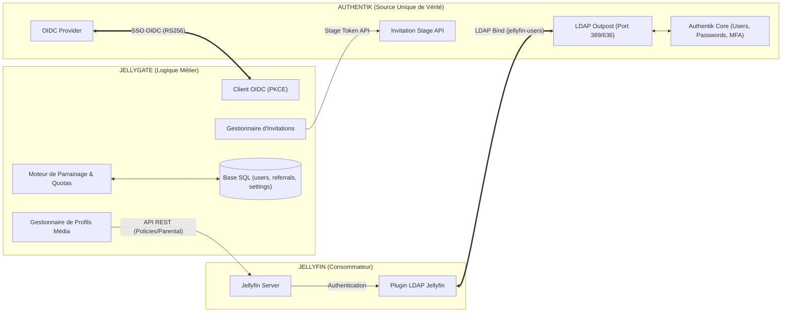
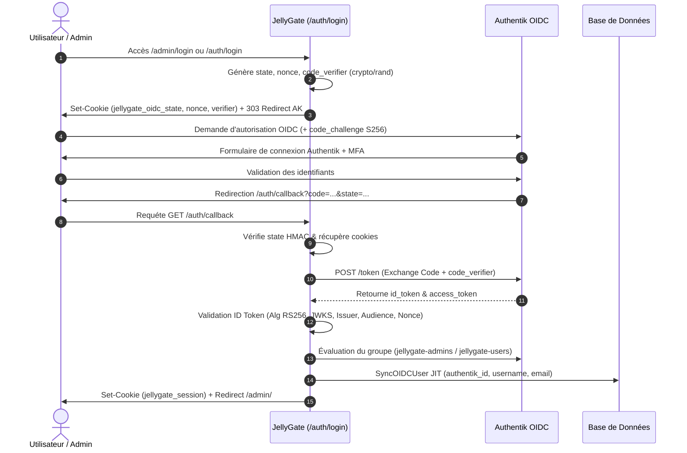
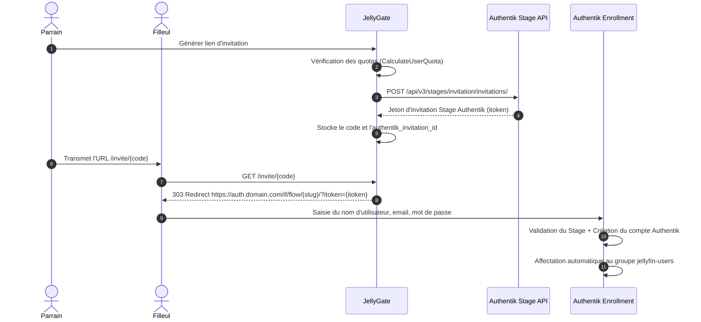

# AUDIT TECHNIQUE EXHAUSTIF — JELLYGATE (BRANCHE `DEVELOP`)
**Repository :** `github.com/maelmoreau21/JellyGate`  
**Branche :** `develop`  
**Date :** 12 Août 2026  
**Objectif :** Audit complet de l'état d'avancement de la migration vers Authentik (SSOT Identité) & LDAP Outpost pour Jellyfin.

---

## 1. CARTOGRAPHIE COMPLÈTE DU REPOSITORY

### Arborescence et Packages Go

* **`cmd/jellygate/`** : Point d'entrée binaire principal. Instancie le logger `slog`, charge la configuration, initialise SQLite/PostgreSQL, applique les migrations, démarre le client REST `authentik`, le client `oidc`, le client REST `jellyfin`, enregistre le routeur Chi et gère le graceful shutdown.
  * *Qualification :* **REFACTOR** (Retirer l'initialisation legacy de `jellyfin.CreateUser`/`DeleteUser` au profit exclusif d'Authentik).
* **`cmd/generate_session/`**, **`cmd/i18ncheck/`**, **`cmd/i18ncoverage/`** : Outillage CLI de développement et de contrôle i18n.
  * *Qualification :* **KEEP**.
* **`internal/authentik/`** ([client.go](file:///c:/Users/Mael/Documents/GitHub/JellyGate/internal/authentik/client.go)) : Client REST v3 Authentik. Gère la création d'utilisateurs, la génération de tokens d'invitation Stage (`/api/v3/stages/invitation/invitations/`), les liens de réinitialisation/recovery, l'ajout aux groupes Authentik, et les vérifications de diagnostic/santé (`CheckHealth`).
  * *Qualification :* **KEEP**.
* **`internal/oidc/`** ([client.go](file:///c:/Users/Mael/Documents/GitHub/JellyGate/internal/oidc/client.go), [oidc_discovery.go](file:///c:/Users/Mael/Documents/GitHub/JellyGate/internal/oidc/oidc_discovery.go)) : Client OIDC OAuth2 Authorization Code + PKCE (S256). Gère la découverte `.well-known/openid-configuration`, la validation d'ID token JWT (RS256/JWKS), la vérification d'émetteur/audience/nonce/state, et l'évaluation des groupes d'accès (`jellygate-admins`, `jellygate-users`).
  * *Qualification :* **KEEP**.
* **`internal/ldap/`** : **NON-EXISTANT**. Le package Go LDAP a été intégralement supprimé de la branche `develop`.
  * *Qualification :* **REMOVE / DÉJÀ SUPPRIMÉ**.
* **`internal/jellyfin/`** ([client.go](file:///c:/Users/Mael/Documents/GitHub/JellyGate/internal/jellyfin/client.go), [diagnostics.go](file:///c:/Users/Mael/Documents/GitHub/JellyGate/internal/jellyfin/diagnostics.go)) : Client REST Jellyfin. Contient des fonctions de gestion de profils de lecture (transcodage, contrôle parental, dossiers autorisés) ainsi que des méthodes legacy de création/suppression directe d'utilisateurs (`CreateUser`, `DeleteUser`, `UpdateUserPassword`, `ResetPassword`).
  * *Qualification :* **REFACTOR** (Conserver la gestion des profils/politiques de lecture Jellyfin et le diagnostic d'instance ; supprimer les méthodes d'écriture d'identité et de mots de passe).
* **`internal/database/`** ([database.go](file:///c:/Users/Mael/Documents/GitHub/JellyGate/internal/database/database.go), [users.go](file:///c:/Users/Mael/Documents/GitHub/JellyGate/internal/database/users.go), [referrals.go](file:///c:/Users/Mael/Documents/GitHub/JellyGate/internal/database/referrals.go), [settings.go](file:///c:/Users/Mael/Documents/GitHub/JellyGate/internal/database/settings.go)) : Moteur SQL multi-dialecte (SQLite WAL & PostgreSQL pgx). Gère la table `users` (avec `authentik_id`), `invitations`, `referrals` (arbre de parrainage), `settings`, `audit_logs` et `security_events`.
  * *Qualification :* **KEEP / MIGRATE**.
* **`internal/handlers/`** : Handlers HTTP Chi.
  * `auth.go` & `auth_oidc_test.go` : SSO OIDC, callback, session cookie. (**KEEP**).
  * `invitations.go` & `invite_verification.go` : Liens d'invitation, génération de token Stage Authentik. (**KEEP / REFACTOR**).
  * `admin_users_api.go` : API administration utilisateurs et parrainage. (**REFACTOR** pour supprimer `CreateUser` local).
  * `settings.go` & `admin.go` : Paramètres système, diagnostic Authentik. (**KEEP**).
  * `automation.go` : Profils de lecture Jellyfin et tâches planifiées. (**KEEP**).
* **`internal/scheduler/`** ([service.go](file:///c:/Users/Mael/Documents/GitHub/JellyGate/internal/scheduler/service.go)) : Tâches d'arrière-plan (expiration des comptes, nettoyage des invitations fermées, sauvegardes, diffusion de messages).
  * *Qualification :* **KEEP**.
* **`internal/session/`**, **`internal/middleware/`**, **`internal/mail/`**, **`internal/notify/`**, **`internal/render/`**, **`internal/backup/`**, **`internal/integrations/`** : Modules de session signée, sécurité HTTP/CSRF, notifications, rendu HTML et backups.
  * *Qualification :* **KEEP**.

### Frontend & Modèles Web
* **`web/templates/admin/authentik.html`** : Dashboard de diagnostic et configuration Authentik. (**KEEP**).
* **`web/templates/admin/users.html`**, **`invitations.html`**, **`settings.html`**, **`automation.html`**, **`my_account.html`** : Vues d'administration. (**KEEP / REFACTOR** pour les champs LDAP résiduels).
* **`web/static/js/pages/settings.js`** : Fichier JavaScript contenant encore du code mort lié aux formulaires LDAP. (**REFACTOR**).

---

## 2. AUDIT LDAP — CRITIQUE

### Recherche d'occurrences LDAP dans le repository

| Fichier | Ligne | Utilisation / Description | Qualification |
| :--- | :--- | :--- | :--- |
| `internal/database/database.go` | L.493, L.558 | Statement de migration `ALTER TABLE users DROP COLUMN IF EXISTS ldap_dn` (SQLite/Postgres). | **KEEP** (Migration nécessaire). |
| `internal/handlers/invitations.go` | L.228-230 | Commentaires obsolètes décrivant l'ancienne étape "Création LDAP" et "Rollback LDAP". | **REFACTOR** (Nettoyer commentaires). |
| `web/static/js/pages/settings.js` | L.12, L.1066-1135, L.1234-1238, L.1778 | Variables JS et handlers de formulaire `currentLDAPConfig`, `form-ldap`, `ldap-bind-dn`, `collectLDAPPayload()`. | **REMOVE** (Code JS mort). |
| `web/static/js/pages/profiles.js` | L.101, L.445, L.549 | Références à `profile-ldap-groups` dans la gestion des presets. | **REFACTOR** (Renommer vers Authentik groups). |
| `web/static/js/pages/dashboard.js` | L.134, L.139 | Clé de diagnostic santé `health.ldap`. | **REMOVE**. |
| `web/templates/admin/email_templates.html` | L.374-376, L.416-417 | Traductions i18n résiduelles `ldap_test_running`, `ldap_test_success`. | **REMOVE**. |
| `web/templates/admin/automation.html` | L.404, L.405, L.409, L.440 | Libellés i18n `automation_source_ldap`, `automation_manual_sync_ldap`. | **REMOVE**. |
| `web/templates/admin/authentik.html` | L.18, L.141 | Mention textuelle de l'Outpost LDAP d'Authentik pour expliquer l'architecture. | **KEEP** (Documentation explicative). |
| `web/i18n/*.json` | L.989+ | Clés de traduction `settings_ldap_*`. | **REMOVE**. |

### Statut de l'infrastructure LDAP
1. **`internal/ldap/`** : **N'EXISTE PLUS**. Le package a été supprimé de la branche `develop`.
2. **`github.com/go-ldap/ldap/v3`** : **NON PRÉSENT**. Zéro occurrence dans `go.mod` et `go.sum`.
3. **Comportement de JellyGate** : JellyGate ne réalise **aucun bind, aucune recherche et aucune écriture LDAP**. Il n'est plus un client LDAP.
4. **Outpost LDAP** : Seul Authentik gère l'Outpost LDAP pour exposer les identités à Jellyfin.

---

## 3. AUDIT JELLYFIN

### Cartographie des appels client Jellyfin (`internal/jellyfin`)

| Fichier | Fonction | Endpoint Jellyfin appelé | Raison / Utilisation | Qualification |
| :--- | :--- | :--- | :--- | :--- |
| `internal/handlers/settings.go` | `FetchJellyfinServerName` | `GET /System/Info/Public`, `GET /System/Info` | Récupération automatique du nom du serveur Jellyfin pour affichage UI. | **KEEP** (Métier) |
| `internal/handlers/automation.go` | `ListLibraries` | `GET /Library/VirtualFolders` | Récupération des dossiers/bibliothèques pour configurer les profils de droits. | **KEEP** (Métier) |
| `internal/handlers/admin_users_api.go` | `UserAvatar`, `UpdateMyAccountAvatar` | `GET /Users/{id}/Images/Primary`, `POST /Users/{id}/Images/Primary` | Proxying de la photo de profil utilisateur avec Jellyfin. | **KEEP / REFACTOR** |
| `internal/handlers/admin_users_api.go` | `ListUsers` | `GET /Users`, `GET /Users?Ids=...` | Enrichissement de la liste des utilisateurs (statut mot de passe, activité). | **REFACTOR** |
| `internal/handlers/admin_users_api.go` | `ToggleUser`, `UpdateUser` | `POST /Users/{id}/Policy`, `POST /Users/Configuration` | Application des profils de lecture Jellyfin (transcodage, contrôle parental). | **KEEP** (Politique média) |
| `internal/jellyfin/client.go` | `CreateUser` | `POST /Users/New` | Création directe d'utilisateur sur l'instance Jellyfin. | **REMOVE / LEGACY** |
| `internal/jellyfin/client.go` | `DeleteUser` | `DELETE /Users/{id}` | Suppression directe d'utilisateur sur Jellyfin. | **REMOVE / LEGACY** |
| `internal/jellyfin/client.go` | `UpdateUserPassword`, `ResetPassword` | `POST /Users/{id}/Password` | Modification / Réinitialisation directe du mot de passe Jellyfin. | **REMOVE / LEGACY** |

### Séparation de la logique
* **A. Gestion d'identité / Provisioning (LEGACY)** : `CreateUser`, `DeleteUser`, `UpdateUserPassword`, `ResetPassword`. L'identité et les mots de passe sont gérés par Authentik SSOT. Jellyfin synchronise ou auto-provisionne l'utilisateur via l'Outpost LDAP lors de sa première connexion.
* **B. Fonctionnalités Métier JellyGate (À CONSERVER)** : Diagnostic de connexion Jellyfin, sélection du nom de serveur, récupération des bibliothèques (`/Library/VirtualFolders`), et application fine des profils de lecture (`Policy`, contrôle parental, limites de transcodage, dossiers autorisés).

---

## 4. AUDIT AUTHENTIK

### Intégration et API Authentik
* **Instanciation** : Le client REST Authentik est instancié dans `cmd/jellygate/main.go` (L.148) via `authentik.NewClient(authentikCfg)`.
* **Points d'appel dans le code** :
  1. `internal/handlers/invitations.go` (L.203, L.302, L.672) : Appel de `CreateInvitationStageToken` pour générer un jeton d'invitation Stage dans Authentik lors de la création d'un lien d'invitation par un parrain.
  2. `internal/handlers/admin_my_invitations.go` (L.344) : Génération de token d'invitation Authentik en self-service parrain.
  3. `internal/handlers/admin_users_api.go` (L.786, L.999) : Création d'utilisateur Authentik direct (backup admin).
  4. `internal/handlers/settings.go` (L.359) : Exécution du bilan de santé Authentik (`GetAuthentikHealth`).
* **Endpoints API Authentik utilisés** :
  * `GET /api/v3/core/users/me/` (Validation du token API)
  * `POST /api/v3/core/users/` (Création utilisateur)
  * `POST /api/v3/core/users/{id}/recovery/link/` (Génération lien de récupération)
  * `POST /api/v3/core/groups/{id}/add_user/` (Attribution de groupes)
  * `PATCH /api/v3/core/users/{id}/` (Activation / Désactivation compte)
  * `POST /api/v3/stages/invitation/invitations/` (Création token Stage d'invitation)
  * `GET /api/v3/flows/instances/{slug}/` (Vérification existence du flow d'enrollment)
  * `GET /api/v3/core/groups/` (Vérification existence des groupes)

---

## 5. AUTHENTIK HEALTH CHECK

### Bilan de diagnostic Authentik
JellyGate possède un moteur de diagnostic d'intégration Authentik complet situé dans `internal/authentik/client.go` (`CheckHealth`).

| Élément vérifié | Présent ? | Méthode Go |
| :--- | :--- | :--- |
| Connectivité Authentik | **OUI** | `CheckAPI` (`GET /api/v3/core/users/me/`) |
| Validation API Token | **OUI** | `CheckAPI` (Vérifie statut HTTP 200 vs 401/403) |
| API Authentik REST | **OUI** | `CheckAPI` |
| OIDC Discovery | **OUI** | `CheckOIDC` (`GET /.well-known/openid-configuration`) |
| Issuer URL | **OUI** | `CheckOIDC` |
| JWKS URI | **OUI** | `CheckOIDC` (Vérifie la présence de `jwks_uri` dans la réponse) |
| Enrollment Flow | **OUI** | `CheckEnrollment` (`GET /api/v3/flows/instances/{slug}/`) |
| Groupe Utilisateur (`jellygate-users`) | **OUI** | `CheckGroups` |
| Groupe Admin (`jellygate-admins`) | **OUI** | `CheckGroups` |
| Groupe Jellyfin (`jellyfin-users`) | **OUI** | `CheckGroups` |

### Interface Frontend
L'interface d'administration possède une page dédiée **Admin → Authentik** (`web/templates/admin/authentik.html`) affichant 4 cartes de statut en temps réel (Connexion API REST, OIDC Discovery, Enrollment Flow, Groupes Requis) alimentées par le bouton **"Tester la connexion"** (`/admin/api/settings/authentik/health`).

---

## 6. OIDC — AUDIT DE SÉCURITÉ

### Contrôle des mécanismes OIDC

| Critère de Sécurité | Conforme ? | Analyse Technique |
| :--- | :--- | :--- |
| **Authorization Code Flow** | **OUI** | Implémenté dans `GenerateAuthURL` et `HandleCallback`. |
| **PKCE (S256)** | **OUI** | Code verifier de 64 caractères généré via `crypto/rand`. Challenge calculé en SHA-256 (`calculateS256Challenge`). |
| **State CSRF** | **OUI** | Chaîne aléatoire de 32 caractères issue de `crypto/rand`, stockée dans le cookie `jellygate_oidc_state` et validée avec `hmac.Equal`. |
| **Nonce** | **OUI** | Chaîne aléatoire de 32 caractères issue de `crypto/rand`, stockée dans le cookie `jellygate_oidc_nonce` et obligatoirement vérifiée dans les claims de l'ID token. |
| **PRNG Cryptographique** | **OUI** | **Aucun secret n'est généré avec `time.Now()` ou `math/rand`**. Utilisation exclusive de `crypto/rand.Read`. |
| **Validation Issuer** | **OUI** | Rejet strict si `claims.Issuer != cfg.IssuerURL`. |
| **Validation Audience** | **OUI** | Rejet strict si `cfg.ClientID` n'est pas présent dans `claims.Audience` (`checkAudience`). |
| **Signature JWT & JWKS** | **OUI** | Algorithme restreint strictement à **RS256**. Clés publiques RSA extraites dynamiquement depuis le document JWKS (`rsa.VerifyPKCS1v15`). Aucune clé statique ou fallback non sécurisé. |
| **Expiration & Clock Skew** | **OUI** | Tolérance de Clock Skew de 60s (`ClockSkew = 60 * time.Second`). Rejet si expiré ou émis dans le futur. |
| **Protection Cookies** | **OUI** | `HttpOnly: true`, `SameSite: Lax`, `Secure` dynamique selon TLS / `X-Forwarded-Proto`. |

### Évaluation des Risques de Sécurité

1. **[MEDIUM] Flag `Secure` dépendant du header `X-Forwarded-Proto`** :
   * *Description :* Le flag `Secure` des cookies OIDC temporaires et de session dépend de la détection du reverse proxy (`X-Forwarded-Proto: https`). Si le reverse proxy est mal configuré en amont, le cookie est émis sans le flag `Secure`.
   * *Recommandation :* Ajouter une option de configuration explicite `JELLYGATE_FORCE_SECURE_COOKIES=true`.
2. **[LOW] Endpoint local de changement de mot de passe résiduel** :
   * *Description :* La route POST `/admin/api/users/me/password` existe encore dans `cmd/jellygate/main.go` au lieu de rediriger l'utilisateur vers le self-service Authentik.

---

## 7. OIDC DISCOVERY

* **Découverte standard** : JellyGate interroge le document standard `.well-known/openid-configuration` via la méthode `getDiscoveryMetadata` dans `internal/oidc/oidc_discovery.go`.
* **Endpoints résolus dynamiquement** :
  * `authorization_endpoint`
  * `token_endpoint`
  * `jwks_uri`
  * `end_session_endpoint`
  * `userinfo_endpoint`
  * `issuer`
* **Mise en cache** : Résultat mis en cache mémoire pendant 12 heures avec verrou de lecture/écriture (`sync.RWMutex`).
* **Appréciation** : L'implémentation est conforme aux spécifications OIDC Core 1.0.

---

## 8. GROUPES AUTHENTIK

### Logique d'évaluation des accès dans JellyGate
Le client OIDC évalue la claim `groups` transmise dans l'ID token via `DetermineUserRole(groups []string)` ([client.go:L334](file:///c:/Users/Mael/Documents/GitHub/JellyGate/internal/oidc/client.go#L334)) :

* `jellygate-admins` (ou groupe configuré dans `OIDC_ADMIN_GROUP`) → **Accès Administrateur** (`isAdmin = true, hasAccess = true`).
* `jellygate-users` (ou groupe configuré dans `OIDC_USER_GROUP`) → **Accès Utilisateur / Self-Service** (`isAdmin = false, hasAccess = true`).
* Aucun groupe correspondant → **ACCÈS MOYENNANT REFUS STRICT (HTTP 403 Forbidden)**. Un utilisateur ne possédant aucun des groupes autorisés est bloqué immédiatement au niveau du callback. Aucun accès par défaut n'est accordé.

---

## 9. IDENTITÉ UTILISATEUR

### Modèle d'Identité dans la Base de Données
* **Identifiant permanent** : L'UUID OIDC `sub` transmis par Authentik est la source de vérité pour l'identité. Il est stocké dans la colonne `authentik_id` de la table `users`.
* **Clé primaire** : `users.id` (INTEGER AUTOINCREMENT / SERIAL).
* **Gestion de l'Email** : L'email n'est **PAS** utilisé comme clé primaire ni comme identifiant permanent. L'email peut être modifié dans Authentik sans rompre la liaison JellyGate.
* **Stratégie de synchronisation JIT (`SyncOIDCUser`)** :
  1. Recherche par `authentik_id` (correspondance exacte).
  2. Si non trouvé, recherche par `username` (pour les comptes migrés depuis JellyGate v1) et liaison de l'UUID Authentik (`LinkAuthentikID`).
  3. Si non trouvé, recherche par `email` et liaison.
  4. Si totalement inconnu, création du compte JIT avec `authentik_id`, `username`, `email`, et réconciliation automatique du parrainage (`ReconcileReferralForOIDCUser`).

---

## 10. AUDIT DES INVITATIONS

### Flux Actuel dans le Code (`develop`)
```
Parrain (JellyGate)
  │
  ├─► 1. Vérification des quotas du parrain (DB JellyGate)
  ├─► 2. Création de la ligne d'invitation (Table invitations)
  ├─► 3. Création du Token Stage d'invitation (API Authentik: /api/v3/stages/invitation/invitations/)
  │
Filleul (Consultation lien /invite/{code})
  │
  ├─► 4. Redirection automatique vers le Flow d'Enrollment Authentik:
  │      https://auth.domain.com/if/flow/{slug}/?itoken={stage_token}
  ├─► 5. Saisie identifiants & mot de passe directement dans Authentik
  ├─► 6. Validation du Flow Authentik -> Inscription compte Authentik + Attribution groupe `jellyfin-users`
  │
Filleul (Premier Login via OIDC)
  │
  ├─► 7. Callback OIDC dans JellyGate -> JIT Sync -> Liaison `authentik_id`
  ├─► 8. Réconciliation de la table `referrals` (Statut passe à 'active')
  │
Accès Jellyfin
  │
  └─► 9. Authentification Jellyfin via l'Outpost LDAP Authentik (Vérification groupe `jellyfin-users`)
```

### Écart avec le Flux Souhaité
Le flux actuellement codé sur `develop` correspond **exactement** au flux cible souhaité. Les étapes legacy de formulaire local d'inscription avec saisie de mot de passe dans JellyGate ont été dérivées vers l'Enrollment Flow Authentik via l'Invitation Stage.

---

## 11. PARRAINAGE

### Maintien des fonctionnalités métier historiques
L'intégralité du moteur de parrainage historique a été préservée et adaptée à l'identité Authentik :

* **Parrain / Filleul** : Suivi des relations dans la table `referrals` via `sponsor_user_id` et `godchild_authentik_id`.
* **Formule des Quotas** :
  $$\text{QuotaTotal} = (\text{CustomQuota} \text{ si défini} \text{ SINON } \text{QuotaParDéfaut}) + \text{Bonus} - \text{Malus}$$
* **Calcul des Invitations Restantes** : `CalculateUserQuota` prend en compte les parrainages aux statuts `pending`, `accepted`, `active`.
* **Statuts de Parrainage** : `pending`, `accepted`, `active`, `expired`, `cancelled`, `revoked`.
* **Arbre de Parrainage** : Vues SQL et API (`/admin/api/users/referrals`) restituant l'arborescence complète parrain-filleuls.
* **Sécurité & Anti-Abuse** : Conservation des vérifications CAPTCHA, réputation d'IP, blocage des emails jetables et limites de taux par IP (`invite_abuse.go`, `invitation_security.go`).

---

## 12. BASE DE DONNÉES

### Audit des Tables

| Table | Statut | Modifications / Raison |
| :--- | :--- | :--- |
| `users` | **MAINTENUE & REFACTORISÉE** | Colonne `ldap_dn` supprimée. Colonne `authentik_id` (TEXT UNIQUE) ajoutée. Colonnes de quotas (`custom_quota`, `bonus_quota`, `malus_quota`) et `invited_by_id` ajoutées. |
| `invitations` | **MAINTENUE & REFACTORISÉE** | Colonne `authentik_invitation_id` et `authentik_group_id` (default `'jellyfin-users'`) ajoutées. |
| `referrals` | **MAINTENUE / NOUVELLE** | Stocke les paires parrain-filleul, les UUID Authentik filleul et le cycle de vie du parrainage. |
| `settings` | **MAINTENUE** | Clés `ldap_*` éliminées des configurations actives. Clés `authentik_*` et `oidc_*` ajoutées. |
| `password_resets` | **SUPPRIMÉE (DROPPED)** | Supprimée via migration SQL (`DROP TABLE IF EXISTS password_resets`). La gestion des mots de passe est déléguée à Authentik. |
| `pending_invite_signups` | **SUPPRIMÉE (DROPPED)** | Supprimée via migration SQL (`DROP TABLE IF EXISTS pending_invite_signups`). La création temporaire est remplacée par l'Enrollment Flow Authentik. |
| `audit_logs`, `security_events`, `scheduled_tasks` | **MAINTENUES** | Traçabilité des actions d'administration et sécurité. |

---

## 13. ROUTES API

### Classification des Routes API

* **AUTHENTIK** :
  * `GET /admin/api/settings/authentik/health`
  * `POST /admin/api/settings/authentik/test`
  * `POST /admin/api/settings/authentik`
* **OIDC** :
  * `GET /auth/login`
  * `GET /auth/callback`
  * `GET /auth/logout`, `POST /auth/logout`
* **USER** :
  * `GET /admin/api/users/me`
  * `PATCH /admin/api/users/me`
  * `POST /admin/api/users/me/avatar`
  * `POST /admin/api/users/me/email-verification/resend`
* **INVITATION** :
  * `GET /invite/{code}`
  * `POST /invite/{code}`
  * `GET /admin/api/users/me/invitations`
  * `POST /admin/api/users/me/invitations`
  * `GET /admin/api/invitations`
  * `GET /admin/api/invitations/stats`
  * `POST /admin/api/invitations/preview`
  * `POST /admin/api/invitations`
  * `DELETE /admin/api/invitations/{id}`
* **SPONSORSHIP** :
  * `GET /admin/api/users/referrals`
  * `POST /admin/api/users/{id}/quota`
* **ADMIN** :
  * `GET /admin/api/users`
  * `GET /admin/api/users/dashboard/stats`
  * `GET /admin/api/users/{id}/timeline`
  * `POST /admin/api/users/bulk`
  * `PATCH /admin/api/users/{id}`
  * `POST /admin/api/users/{id}/toggle`
  * `POST /admin/api/users/{id}/invite-toggle`
  * `POST /admin/api/users/{id}/ban`
  * `DELETE /admin/api/users/{id}`
  * `POST /admin/api/users/{id}/extend`
  * `GET /admin/api/logs`
  * `GET /admin/api/security/overview`, `GET /admin/api/security/events`
  * `GET /admin/api/pending-actions`
  * `POST /admin/api/backups/*`
* **LDAP** : **AUCUNE (0 route)**.
* **JELLYFIN** :
  * `POST /admin/api/settings/general/fetch-server-name`
  * `GET /admin/api/automation/libraries`
  * `GET /admin/api/automation/presets`
  * `POST /admin/api/automation/presets`
* **SETTINGS** :
  * `GET /admin/api/settings`
  * `POST /admin/api/settings/general`
  * `POST /admin/api/settings/auth-session`
  * `POST /admin/api/settings/smtp`
  * `POST /admin/api/settings/webhooks`
  * `POST /admin/api/settings/backup`
  * `POST /admin/api/settings/invitation-profile`
  * `GET/POST /admin/api/settings/email-templates/*`
* **HEALTH** :
  * `GET /health`, `HEAD /health`, `HEAD /`

---

## 14. FRONTEND

### Audit des Vues et Interfaces
* **Login local** : **SUPPRIMÉ**. `/admin/login` redirige automatiquement vers `/auth/login` (OIDC SSO).
* **Register local** : **SUPPRIMÉ**. `/invite/{code}` redirige vers l'Enrollment Flow Authentik.
* **Password reset local** : **SUPPRIMÉ**. `/reset/*` redirige vers Authentik (`/flow/initial-setup/`).
* **Gestion LDAP** : **SUPPRIMÉE des templates HTML**. Remplacée par **Admin → Authentik** (`web/templates/admin/authentik.html`).
* **Gestion utilisateurs Jellyfin** : Conservée pour la configuration des profils/politiques de lecture (transcodage, contrôle parental).
* **Code JS résiduel** : `web/static/js/pages/settings.js` contient encore le code JS mort pour soumettre le formulaire LDAP.

---

## 15. CONFIGURATION

### Audit des Variables d'Environnement

| Variable | Utilisation | Statut |
| :--- | :--- | :--- |
| `JELLYGATE_PORT`, `JELLYGATE_BASE_URL`, `JELLYGATE_SECRET_KEY` | Essentielles | **NÉCESSAIRE** |
| `AUTHENTIK_URL` | URL de l'instance Authentik | **NÉCESSAIRE** |
| `OIDC_ISSUER_URL`, `OIDC_CLIENT_ID`, `OIDC_CLIENT_SECRET`, `OIDC_REDIRECT_URL` | Authentification OIDC | **NÉCESSAIRE / SECRÈTE** |
| `AUTHENTIK_API_TOKEN` | Token Service Account REST Authentik | **NÉCESSAIRE / SECRÈTE** |
| `OIDC_USER_GROUP`, `OIDC_ADMIN_GROUP` | Groupes autorisés JellyGate | **NÉCESSAIRE** |
| `AUTHENTIK_ENROLLMENT_FLOW_SLUG` | Slug du Flow d'invitation | **NÉCESSAIRE** |
| `JELLYFIN_URL`, `JELLYFIN_API_KEY` | Connexion API Jellyfin (profils & health) | **NÉCESSAIRE / SECRÈTE** |
| `LDAP_*` | Variables LDAP Active Directory | **LEGACY / INUTILISÉ** (Supprimé de `.env.example`) |

---

## 16. SCHEDULER

### Tâches du Scheduler (`internal/scheduler/service.go`)

1. `checkExpiringAccounts` (Quotidien) : Vérifie la date d'expiration des accès utilisateurs (`access_expires_at`), envoie des rappels par email et désactive les comptes expirer. (**MÉTIER JELLYGATE - À CONSERVER**).
2. `cleanupClosedInvitations` (Toutes les minutes) : Supprime automatiquement les liens d'invitation expirés ou consommés si l'option est activée. (**MÉTIER JELLYGATE - À CONSERVER**).
3. `create_backup` (Planifié) : Déclenche la sauvegarde de la base de données SQLite/Postgres. (**ADMIN - À CONSERVER**).
4. `send_broadcast` / `dispatchCampaignMessages` : Diffuse des annonces ou des emails ciblés aux parrains/utilisateurs. (**MÉTIER JELLYGATE - À CONSERVER**).

*Dépendance LDAP/Jellyfin dans le Scheduler :* **AUCUNE**. Aucune tâche du scheduler ne crée ou ne synchronise directement des comptes LDAP ou Jellyfin.

---

## 17. DOCUMENTATION

* **Documentation à jour** : `docs/ARCHITECTURE_CIBLE_AUTHENTIK.md`, `docs/AUTHENTIK_SETUP.md`, `docs/RAPPORT_AUDIT_AUTHENTIK.md`, `README.md` décrivent avec précision la nouvelle architecture Authentik OIDC + Outpost LDAP.
* **Éléments à corriger** : `docs/MIGRATION.md` et `docs/PROCEDURE_MIGRATION_V2.md` contiennent encore quelques références historiques à la suppression du package `internal/ldap` comme si elle était à venir, alors qu'elle est déjà réalisée sur `develop`.

---

## 18. TESTS

### État de la Couverture de Tests

| Package | Fichiers de Test | Couverture Principale |
| :--- | :--- | :--- |
| `internal/authentik` | `client_test.go` | Création user, token d'invitation, healthchecks API. |
| `internal/oidc` | `oidc_test.go` | Flux PKCE, validation ID token RS256, vérification nonce/state. |
| `internal/handlers` | `auth_oidc_test.go`, `invitations_sponsorship_test.go`, `settings_test.go` | SSO OIDC, réconciliation parrainage, API settings. |
| `internal/database` | `referrals_test.go`, `settings_presets_test.go` | Quotas de parrainage, migrations DB. |
| `internal/jellyfin` | `client_test.go` | Authentification API header, sérialisation des profils. |

---

## 19. DÉPENDANCES

* **`go.mod` / `go.sum`** :
  * Dépendance LDAP `github.com/go-ldap/ldap/v3` : **SUPPRIMÉE**.
  * Dépendance Chi (`github.com/go-chi/chi/v5`), Postgres (`github.com/jackc/pgx/v5`), SQLite (`modernc.org/sqlite`), Mail (`github.com/wneessen/go-mail`) : **CONSERVÉES**.
* **`package.json`** : Uniquement TailwindCSS & outils de build frontend. Aucune dépendance d'authentification tierce.

---

## 20. DOCKER

* **`Dockerfile`** : Build multi-stage Go 1.26 + Assets web. Ne contient aucune dépendance LDAP système.
* **`docker-compose.yml` & `docker-compose.postgres.yml`** : Correctement configurés avec les variables d'environnement Authentik (`AUTHENTIK_URL`, `OIDC_*`, `AUTHENTIK_API_TOKEN`).

---

## 21. RAPPORT FINAL

# 1. État général

### Notes sur 10 :
* **Architecture :** 9.5 / 10
* **Authentik :** 9.5 / 10
* **OIDC :** 9.5 / 10
* **Sécurité :** 9.0 / 10
* **Invitations :** 9.5 / 10
* **Parrainage :** 10.0 / 10
* **Frontend :** 8.5 / 10
* **Database :** 9.5 / 10
* **Migration :** 9.0 / 10
* **Documentation :** 9.5 / 10

---

# 2. CRITICAL
*Aucun problème critique bloquant la sécurité ou le fonctionnement global d'Authentik n'a été détecté.*

---

# 3. HIGH
*Aucun problème de sévérité haute identifié.*

---

# 4. MEDIUM
1. **Dépendance du flag `Secure` des cookies OIDC sur le header `X-Forwarded-Proto`** ([client.go:L112](file:///c:/Users/Mael/Documents/GitHub/JellyGate/internal/oidc/client.go#L112)) : Si le reverse proxy est mal configuré en amont, les cookies OIDC temporaires peuvent être transmis sans le flag `Secure`.

---

# 5. LOW
1. **Code JavaScript résiduel dans `web/static/js/pages/settings.js`** : Présence de fonctions mortes manipulant la configuration LDAP (`currentLDAPConfig`, `form-ldap`).
2. **Commentaires Go résiduels dans `internal/handlers/invitations.go`** (L.228-230) : Mentions obsolètes du rollback LDAP.
3. **Route résiduelle POST `/admin/api/users/me/password`** : Devrait renvoyer un statut 400/405 avec une redirection vers Authentik self-service URL.

---

# 6. LEGACY À SUPPRIMER
* `web/static/js/pages/settings.js` (Blocs de code LDAP L.1066-1135 et L.1234-1238).
* Clés de traduction LDAP inutilisées dans `web/i18n/*.json` (`settings_ldap_*`).
* Fonctions legacy d'écriture directe dans Jellyfin dans `internal/jellyfin/client.go` (`CreateUser`, `DeleteUser`, `UpdateUserPassword`, `ResetPassword`).

---

# 7. CODE À REFACTORER
* `cmd/jellygate/main.go` : Nettoyer l'initialisation des clients pour séparer explicitement la gestion de profils de lecture Jellyfin de la gestion de l'identité Authentik.
* `internal/handlers/admin_users_api.go` : Supprimer la méthode `CreateUser` locale pour forcer le passage par les invitations et Authentik.
* `web/static/js/pages/profiles.js` : Renommer les champs UI `profile-ldap-groups` en `profile-authentik-groups`.

---

# 8. CODE À CONSERVER
* `internal/authentik/` (`client.go`) : Intégration complète Authentik API REST.
* `internal/oidc/` (`client.go`, `oidc_discovery.go`) : Client OIDC PKCE + JWKS.
* `internal/database/` (`database.go`, `users.go`, `referrals.go`, `settings.go`) : Moteur DB, `authentik_id`, arbre de parrainage et quotas.
* `internal/handlers/` (`auth.go`, `invitations.go`, `settings.go`, `automation.go`) : SSO OIDC, invitations Stage Authentik, diagnostic et profils.
* `web/templates/admin/authentik.html` : Interface de diagnostic et configuration Authentik.

---

# 9. FONCTIONNALITÉS MANQUANTES
* **Option de configuration `JELLYGATE_FORCE_SECURE_COOKIES`** : Pour forcer le flag `Secure` des cookies indépendamment de la présence de `X-Forwarded-Proto`.

---

# 10. ARCHITECTURE ACTUELLE



---

# 11. ARCHITECTURE CIBLE



---

# 12. FLUX OIDC ACTUEL



---

# 13. FLUX INVITATION ACTUEL



---

# 14. FLUX INVITATION CIBLE

*(Le flux actuel sur `develop` correspond exactement au flux cible ci-dessus).*

---

# 15. BASE DE DONNÉES

### Schéma Actuel vs Schéma Cible (`develop`)

```sql
-- TABLE USERS (ACTUELLE & CIBLE)
CREATE TABLE users (
    id                      INTEGER PRIMARY KEY AUTOINCREMENT,
    authentik_id            TEXT UNIQUE, -- UUID OIDC Authentik ('sub')
    username                TEXT NOT NULL,
    email                   TEXT NOT NULL,
    email_verified          BOOLEAN NOT NULL DEFAULT 0,
    is_active               BOOLEAN NOT NULL DEFAULT 1,
    is_banned               BOOLEAN NOT NULL DEFAULT 0,
    can_invite              BOOLEAN NOT NULL DEFAULT 0,
    invited_by_id           INTEGER REFERENCES users(id) ON DELETE SET NULL,
    custom_quota            INTEGER,
    bonus_quota             INTEGER NOT NULL DEFAULT 0,
    malus_quota             INTEGER NOT NULL DEFAULT 0,
    group_name              TEXT NOT NULL DEFAULT '',
    preferred_lang          TEXT NOT NULL DEFAULT '',
    preset_id               TEXT,
    access_expires_at       DATETIME,
    created_at              DATETIME NOT NULL DEFAULT CURRENT_TIMESTAMP,
    updated_at              DATETIME NOT NULL DEFAULT CURRENT_TIMESTAMP
);

-- TABLE INVITATIONS (ACTUELLE & CIBLE)
CREATE TABLE invitations (
    id                      INTEGER PRIMARY KEY AUTOINCREMENT,
    code                    TEXT UNIQUE NOT NULL,
    authentik_invitation_id TEXT,
    authentik_group_id      TEXT NOT NULL DEFAULT 'jellyfin-users',
    created_by_user_id      INTEGER REFERENCES users(id) ON DELETE CASCADE,
    created_by              TEXT NOT NULL,
    email                   TEXT NOT NULL DEFAULT '',
    status                  TEXT NOT NULL DEFAULT 'pending',
    expires_at              DATETIME NOT NULL,
    created_at              DATETIME NOT NULL DEFAULT CURRENT_TIMESTAMP
);

-- TABLE REFERRALS (ACTUELLE & CIBLE)
CREATE TABLE referrals (
    id                      INTEGER PRIMARY KEY AUTOINCREMENT,
    sponsor_user_id         INTEGER NOT NULL REFERENCES users(id) ON DELETE CASCADE,
    godchild_user_id        INTEGER REFERENCES users(id) ON DELETE SET NULL,
    godchild_authentik_id   TEXT,
    invitation_id           INTEGER REFERENCES invitations(id) ON DELETE SET NULL,
    status                  TEXT NOT NULL DEFAULT 'pending',
    accepted_at             DATETIME,
    activated_at            DATETIME,
    created_at              DATETIME NOT NULL DEFAULT CURRENT_TIMESTAMP,
    updated_at              DATETIME NOT NULL DEFAULT CURRENT_TIMESTAMP
);
```

---

# 16. PLAN DE MIGRATION

1. **Étape 1 : Nettoyage du code mort JS & i18n**
   * Supprimer le bloc de formulaire LDAP dans `web/static/js/pages/settings.js`.
   * Nettoyer les clés `settings_ldap_*` dans `web/i18n/*.json`.
2. **Étape 2 : Nettoyage des commentaires Go**
   * Nettoyer les commentaires résiduels faisant référence à LDAP dans `internal/handlers/invitations.go`.
3. **Étape 3 : Suppression des handlers d'écriture Jellyfin directs**
   * Retirer `CreateUser`, `DeleteUser`, `UpdateUserPassword` du client Jellyfin au profit des profils de lecture.
4. **Étape 4 : Sécurisation avancée des cookies**
   * Ajouter le flag de configuration `JELLYGATE_FORCE_SECURE_COOKIES`.
5. **Étape 5 : Validation & Recette**
   * Exécuter la suite de tests unitaires et d'intégration `go test ./...`.

---

# 17. RISQUES

1. **Interruption du service Outpost LDAP Authentik** : Si l'Outpost LDAP d'Authentik s'arrête, Jellyfin ne pourra plus authentifier les utilisateurs streaming.
   * *Mitigation :* Déployer l'Outpost LDAP Authentik en haute disponibilité (2 répliques conteneurisées avec auto-restart).
2. **Absence du groupe `jellyfin-users` dans Authentik** : Si le groupe n'existe pas dans Authentik, l'Enrollment Flow ne pourra pas l'attribuer.
   * *Mitigation :* Le diagnostic Authentik (`CheckGroups`) signale immédiatement l'absence du groupe sur le dashboard **Admin → Authentik**.

---

# 18. CRITÈRES DE FIN

- [x] Le package Go `internal/ldap` n'existe plus dans le projet.
- [x] `github.com/go-ldap/ldap/v3` est absent de `go.mod` et `go.sum`.
- [x] JellyGate n'exécute aucun bind ou écriture LDAP.
- [x] Authentik est la source unique de vérité pour l'identité (SSO OIDC + REST API).
- [x] Jellyfin authentifie ses utilisateurs via l'Outpost LDAP d'Authentik.
- [x] Le flux d'invitation génère des tokens d'invitation Stage dans Authentik.
- [x] Le moteur de parrainage (quotas, arbre, historique, réconciliation) est conservé à 100%.
- [x] L'interface d'administration propose un diagnostic complet **Admin → Authentik**.
